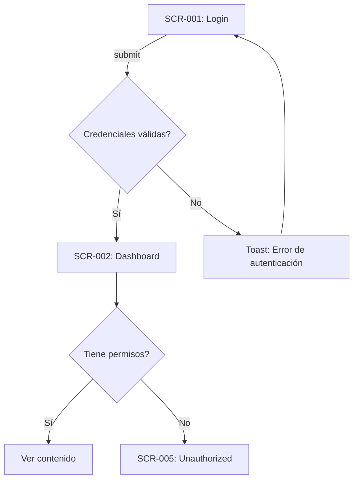

# Design Specification — {{PROJECT_NAME}}

> Generado desde Discovery Brief y Docs por `/design`
> **Fuente:** docs/planning/00_DISCOVERY_BRIEFING.md, 01-08
> **SSOT:** Este doc → código UI (cuando exista)

---

## 📱 Mapa de Pantallas

| ID | Pantalla | URL | Propósito | Acceso | Stories |
|----|----------|-----|-----------|--------|---------|
| SCR-001 | Login | `/login` | Autenticación de usuarios | Público | US-001 |
| SCR-002 | Dashboard | `/dashboard` | Vista principal post-login | P-001, P-002 | US-002 |
| SCR-003 | {{pantalla}} | `/{{url}}` | {{propósito}} | {{P-XXX}} | {{US-XXX}} |

**Leyenda de Acceso:**
- `Público` — Sin autenticación
- `P-XXX` — Requiere persona/rol específico

---

## 🧭 Navegación y Sidebar

**Estructura del Sidebar:**
```
┌─────────────────────┐
│ [Logo]              │
├─────────────────────┤
│ 📊 Dashboard        │  → P-001, P-002
│ 👥 Usuarios         │  → P-001 only
│   └─ Lista          │
│   └─ Roles          │
│ ⚙️ Configuración    │  → P-001 only
├─────────────────────┤
│ [Perfil Usuario]    │
└─────────────────────┘
```

**Ítems de Navegación:**

| Ítem | SCR | URL | Icono | Acceso |
|------|-----|-----|-------|--------|
| Dashboard | SCR-002 | `/dashboard` | LayoutDashboard | P-001, P-002 |
| Usuarios | SCR-003 | `/dashboard/users` | Users | P-001 |
| Configuración | SCR-004 | `/dashboard/settings` | Settings | P-001 |

**Comportamiento:**
- [ ] Sidebar colapsable en desktop
- [ ] Drawer en mobile
- [ ] Indicador de página activa
- [ ] Submenues expandibles

---

## 🔄 Flujos Principales

### FLW-001: Autenticación

**Descripción:** Usuario inicia sesión en la aplicación.
**Personas:** P-001 (Admin), P-002 (User)
**Stories:** US-001



**Estados:**
- **Happy path:** Login → Dashboard → Contenido
- **Error:** Credenciales inválidas → Toast error → Retry
- **Edge case:** Token expirado → Redirect a login

---

### FLW-002: {{Nombre del Flujo}}

**Descripción:** {{Qué logra el usuario}}
**Personas:** {{P-XXX}}
**Stories:** {{US-XXX}}

```mermaid
graph TD
    A[{{SCR-XXX}}] --> B{{{Decisión}}}
    B -->|Opción 1| C[{{Acción 1}}]
    B -->|Opción 2| D[{{Acción 2}}]
```

**Estados:**
- **Happy path:** {{descripción}}
- **Error:** {{cómo se maneja}}
- **Edge case:** {{casos especiales}}

---

### FLW-003: {{Nombre del Flujo}}

{{Repetir estructura}}

---

## 🧩 Componentes por Pantalla

### SCR-001: Login

**Componentes SK:**
| Componente | Uso | Variante |
|------------|-----|----------|
| Card | Contenedor del form | - |
| Form | Formulario de login | - |
| Input | Email, Password | type="email", type="password" |
| Button | Submit | variant="default" |

**Componentes Nuevos:** —

**Estados:**
- [ ] Default (form vacío)
- [ ] Loading (submitting)
- [ ] Error (credenciales inválidas)
- [ ] Success (redirect)

---

### SCR-002: Dashboard

**Componentes SK:**
| Componente | Uso | Variante |
|------------|-----|----------|
| PageHeader | Título + acciones | - |
| Card | Stat cards | - |
| DataTable | Lista principal | - |

**Componentes Nuevos:**

| ID | Nombre | Descripción | Prioridad |
|----|--------|-------------|-----------|
| CMP-001 | StatCard | Card con métrica, trend, icon | P1 |
| CMP-002 | {{nombre}} | {{descripción}} | P1/P2/P3 |

**Estados:**
- [ ] Loading (Skeleton)
- [ ] Empty (EmptyState)
- [ ] Error (Error boundary)
- [ ] Con datos

---

### SCR-XXX: {{Pantalla}}

{{Repetir estructura}}

---

## 📊 Data Requirements

### Server Components (Fetch)

| SCR | Data | Server Action | Cache | Revalidate |
|-----|------|---------------|-------|------------|
| SCR-002 | Stats | `getDashboardStats()` | 1h | on-demand |
| SCR-003 | Users | `getUsers()` | none | on mutation |
| {{SCR}} | {{data}} | {{action}} | {{cache}} | {{revalidate}} |

### Client Mutations

| Acción | Server Action | Optimistic UI | Revalidation |
|--------|---------------|---------------|--------------|
| Create user | `createUser()` | No | `/users` |
| Update user | `updateUser()` | Sí | `/users/[id]` |
| {{acción}} | {{action}} | Sí/No | {{paths}} |

---

## 🎨 Wireframes

### SCR-002: Dashboard

```
┌────────────────────────────────────────────────────┐
│ [Logo]  Nav1  Nav2  Nav3             [Avatar ▼]    │
├────────────────────────────────────────────────────┤
│                                                    │
│  Dashboard                           [+ Action]    │
│                                                    │
│  ┌──────────┐ ┌──────────┐ ┌──────────┐           │
│  │ Stat 1   │ │ Stat 2   │ │ Stat 3   │           │
│  │ 1,234 ▲  │ │ 567 ▼    │ │ 89%      │           │
│  └──────────┘ └──────────┘ └──────────┘           │
│                                                    │
│  Lista Principal                                   │
│  ┌──────────────────────────────────────────────┐  │
│  │ [x] Name    Email         Role    Actions    │  │
│  │ [ ] John    john@...      Admin   [...]     │  │
│  │ [ ] Jane    jane@...      User    [...]     │  │
│  └──────────────────────────────────────────────┘  │
│                                                    │
│  [Prev] 1 2 3 ... [Next]                          │
│                                                    │
└────────────────────────────────────────────────────┘
```

---

## 📋 Decisiones de Diseño

| ID | Decisión | Opciones | Elegida | Razón |
|----|----------|----------|---------|-------|
| DD-001 | Sidebar vs Top Nav | A) Sidebar colapsable, B) Top nav | A | Más espacio para contenido, estándar en dashboards |
| DD-002 | Modal vs Page para crear | A) Dialog modal, B) Nueva página | A | Operación rápida, no pierde contexto |
| DD-003 | {{decisión}} | A/B | {{elegida}} | {{razón}} |

---

## Open Questions

| # | Pregunta | Impacto | Afecta | Owner |
|---|----------|---------|--------|-------|
| OQ-01 | ¿Dashboard tiene dark mode? | Med | SCR-002+ | Cliente |
| OQ-02 | ¿Notificaciones en tiempo real? | **Alto** | FLW-XXX | Architect |
| OQ-03 | {{pregunta}} | Alto/Med/Bajo | {{SCR/FLW}} | {{owner}} |

---

## Assumptions

| # | Supuesto | Si es incorrecto |
|---|----------|------------------|
| A-01 | Usuarios tienen email único | Cambiar validación de login |
| A-02 | Max 100 items en listas sin virtualization | Implementar virtual scroll |
| A-03 | {{supuesto}} | {{impacto}} |

---

## ✅ Checklist Pre-Backlog

- [ ] Todas las pantallas mapeadas (SCR-XXX)
- [ ] Mínimo 3 flujos documentados (FLW-XXX)
- [ ] Componentes SK identificados por pantalla
- [ ] Componentes nuevos listados (CMP-XXX)
- [ ] Data requirements definidos
- [ ] Estados por pantalla considerados
- [ ] Cross-refs a P/US/BR/E completos
- [ ] Decisiones de diseño documentadas
- [ ] Open Questions con owner asignado
- [ ] Assumptions con impacto definido

---

## Referencias

- Discovery Brief: `docs/planning/00_DISCOVERY_BRIEFING.md`
- User Personas: `docs/planning/01_USER_PERSONAS.md`
- User Stories: `docs/planning/02_USER_STORIES.md`
- Business Rules: `docs/planning/03_BUSINESS_RULES.md`
- Data Model: `docs/planning/04_DATA_MODEL.md`
- Architecture: `docs/planning/05_ARCHITECTURE.md`

---

*Generado por TimeKast Factory — /design*
