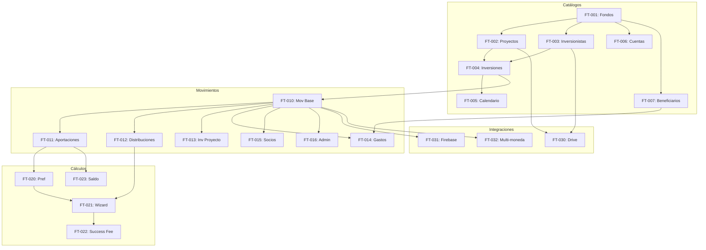

# 📋 Feature Map — Adi Capital Admin

> Generado desde Discovery Brief §3 por `/docs`
> **Fuente:** `docs/planning/00_DISCOVERY_BRIEFING.md`
> **SSOT:** Este documento define el alcance de features.

---

## 🎯 MVP Features (v1.0)

> Features que **DEBEN** estar en el primer release (Feb 28, 2026).

### Core: Catálogos

| FT | Feature | Descripción | Deps | Riesgo | Stories |
|----|---------|-------------|------|--------|---------|
| FT-001 | Gestión de Fondos | CRUD de fondos con configuración de cascada y moneda base | — | Low | US-001 → US-003 |
| FT-002 | Gestión de Proyectos | CRUD de proyectos con tasas, fees y método cascada | FT-001 | Med | US-004 → US-008 |
| FT-003 | Gestión de Inversionistas | CRUD de inversionistas con datos de contacto y fundador flag | FT-001 | Med | US-009 → US-013 |
| FT-004 | Gestión de Inversiones | CRUD de inversiones con compromisos y config de fees | FT-002, FT-003 | High | US-014 → US-018 |
| FT-005 | Calendario de Pagos | CRUD de capital calls programados por inversión | FT-004 | Med | US-019 → US-021 |
| FT-006 | Cuentas Bancarias | CRUD de cuentas del fondo con saldos | FT-001 | Low | US-022 → US-024 |
| FT-007 | Beneficiarios | CRUD de beneficiarios para gastos | FT-001 | Low | US-025 → US-026 |

### Core: Movimientos Financieros

| FT | Feature | Descripción | Deps | Riesgo | Stories |
|----|---------|-------------|------|--------|---------|
| FT-010 | Movimientos Base | Registro de movimientos con estados Borrador/Confirmado/Cancelado | FT-004 | High | US-030 → US-035 |
| FT-011 | Aportaciones (APO/APO-D) | Registro de aportaciones de capital | FT-010 | High | US-036 → US-038 |
| FT-012 | Distribuciones (DIS/DEV/FEE) | Registro de repartos y devoluciones | FT-010 | High | US-039 → US-042 |
| FT-013 | Inversiones a Proyecto (INV/INV-D/RET) | Registro de flujo hacia proyectos | FT-010 | High | US-043 → US-046 |
| FT-014 | Gastos (GAS/GASP) | Registro de gastos administrativos y de proyecto | FT-010, FT-007 | Med | US-047 → US-049 |
| FT-015 | Operaciones Socios (APS/RPS/PRS/DPRS) | Movimientos exclusivos de fundadores | FT-010 | Med | US-050 → US-053 |
| FT-016 | Operaciones Admin (TRA/CAM/ERR/TSI) | Traspasos, cambios y ajustes | FT-010 | Med | US-054 → US-058 |

### Core: Cálculos Automáticos

| FT | Feature | Descripción | Deps | Riesgo | Stories |
|----|---------|-------------|------|--------|---------|
| FT-020 | Cálculo de Pref | Acumulación diaria de interés preferencial | FT-011 | High | US-060 → US-062 |
| FT-021 | Wizard de Reparto | Asistente guiado para distribución con cascada | FT-012, FT-020 | High | US-063 → US-067 |
| FT-022 | Cálculo Success Fee | Cálculo automático de comisión sobre utilidades | FT-021 | Med | US-068 → US-069 |
| FT-023 | Saldo Compromiso | Tracking de aportaciones vs compromiso | FT-011 | Med | US-070 |

### Core: Integraciones

| FT | Feature | Descripción | Deps | Riesgo | Stories |
|----|---------|-------------|------|--------|---------|
| FT-030 | Gestión Documental | Navegación y subida de archivos a Drive | FT-002, FT-003 | High | US-080 → US-085 |
| FT-031 | Sync Firebase | Sincronización de datos a app móvil | FT-010 | High | US-086 → US-089 |
| FT-032 | Multi-moneda | Soporte MXN/USD/EUR/ILS con tipo de cambio | FT-010 | Med | US-090 → US-092 |

### Core: Comunicaciones

| FT | Feature | Descripción | Deps | Riesgo | Stories |
|----|---------|-------------|------|--------|---------|
| FT-040 | Noticias | CRUD de comunicados para app móvil | FT-031 | Low | US-095 → US-097 |

### Core: Admin Panel

| FT | Feature | Descripción | Deps | Riesgo | Stories |
|----|---------|-------------|------|--------|---------|
| FT-050 | Dashboard | Vista resumen de fondos y métricas | FT-001 | Med | US-100 → US-102 |
| FT-051 | Gestión Usuarios | CRUD de usuarios admin con roles | — | Med | US-103 → US-106 |
| FT-052 | RBAC | Control de acceso por rol y fondo | FT-051 | High | US-107 → US-109 |
| FT-053 | PWA | Panel instalable como app | — | Low | US-110 |

**Total MVP:** 24 features

---

## 📋 Post-MVP Features

> Features para versiones futuras, ya identificadas.

| FT | Feature | Descripción | Deps | Target | Riesgo |
|----|---------|-------------|------|--------|--------|
| FT-100 | Reportes TIR/IRR | Cálculo de métricas de rendimiento | FT-021 | v1.1 | High |
| FT-101 | Gráficos de Rendimiento | Visualizaciones de performance | FT-100 | v1.1 | Med |
| FT-102 | Comisionistas | Gestión de comisiones por referido | FT-003 | v1.2 | Med |
| FT-103 | Agentes de Ventas | Rol con acceso limitado a sus inversionistas | FT-052 | v1.2 | Med |
| FT-104 | Notificaciones Push | Alertas desde el panel admin | FT-031 | v1.2 | Med |
| FT-105 | Multi-idioma | Soporte ES/EN | — | v2.0 | Low |
| FT-106 | Importación Sheets | Migración masiva desde hojas existentes | — | v1.1 | High |
| FT-107 | API Pública | REST/GraphQL para integraciones externas | FT-010 | v2.0 | High |

---

## 🚫 Non-Goals (Explícitamente fuera de scope)

> Lo que **NO** haremos. Esto previene scope creep.

| NG | Non-Goal | Razón | Reconsiderar en |
|----|----------|-------|-----------------|
| NG-001 | Modificar app móvil Flutter | Solo consumimos Firebase, no modificamos app | Nunca (scope separado) |
| NG-002 | Migración automática desde Sheets | Complejidad alta, se hará manualmente | v1.1 |
| NG-003 | Offline mode completo | PWA básico es suficiente para MVP | v2.0 |
| NG-004 | Portal de inversionistas web | Los inversionistas usan la app móvil existente | v2.0 |
| NG-005 | Contabilidad integrada | Fuera del alcance del panel admin | Nunca |
| NG-006 | Generación de contratos | Documentos legales fuera de scope | v2.0 |

---

## 📊 Resumen

| Métrica | Valor |
|---------|-------|
| Features MVP | 24 |
| Features Post-MVP | 8 |
| Non-Goals declarados | 6 |
| Cobertura de §3 | 100% |

---

## Reglas de Trazabilidad

1. **Toda User Story (US-XXX) debe referenciar un FT-XXX**
2. **Todo Screen (SCR-XXX) debe mapear a un FT-XXX**
3. **Todo Issue del backlog debe referenciar FT-XXX**

---

## Dependencias Visuales

---

## Open Questions

| # | Pregunta | Impacto | Owner |
|---|----------|---------|-------|
| OQ-01 | ¿El cálculo de Pref debe ejecutarse como cron job o trigger en cada movimiento? | **Alto** | Dev |
| OQ-02 | ¿Qué nivel de detalle se sincroniza a Firebase? Solo saldos o también movimientos individuales? | **Alto** | Cliente |

---

## Assumptions

| # | Supuesto | Si es incorrecto |
|---|----------|------------------|
| A-01 | Los 18 tipos de movimiento cubren todos los casos de negocio actuales | Impacto: Agregar nuevos conceptos requiere cambios en schema |
| A-02 | La estructura de Drive del cliente ya existe y está organizada | Impacto: Necesitaríamos script de setup inicial |
| A-03 | Firebase Auth del gemelo puede recibir usuarios migrados | Impacto: Estrategia de migración cambia |

---

*Generado por TimeKast Factory — /docs*
