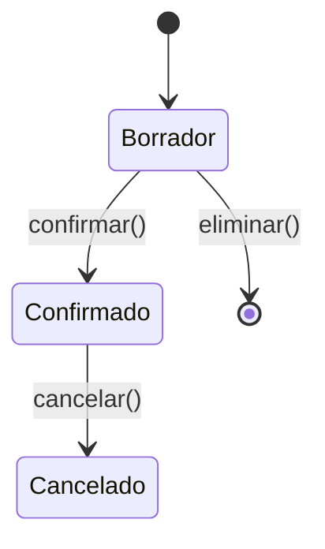

# 📋 Business Rules — Adi Capital Admin

> Generado desde Discovery Brief §6 por `/docs`
> **Fuente:** `docs/planning/00_DISCOVERY_BRIEFING.md`
> **SSOT:** Este documento define las reglas de negocio.

---

## Nomenclatura

| Rango | Categoría |
|-------|-----------|
| BR-001 → BR-019 | Reglas de Entidades (Validaciones) |
| BR-020 → BR-029 | Reglas de Movimientos (Estados) |
| BR-030 → BR-039 | Reglas de Cálculos (Pref, Cascada) |
| BR-040 → BR-049 | Reglas de Fees y Comisiones |
| BR-050 → BR-079 | Reglas de RBAC (Permisos) |
| BR-080 → BR-099 | Reglas de Integraciones |

---

## Reglas Fundamentales

### BR-001: Movimiento Ledger = SSOT

> **SIEMPRE:** Todos los campos `cached_*` se calculan desde movimientos confirmados.
> **NUNCA:** Calcular un cache desde otro cache.

| Campo | Calculado desde |
|-------|-----------------|
| `capital_aportado` | SUM(APO confirmados) |
| `pref_acumulado` | Cálculo diario desde capital |
| `pref_pagado` | SUM(DIS a Pref confirmados) |
| `capital_socios` | SUM(APS - RPS confirmados) |

---

## Reglas de Entidades

### BR-002: Fondo - Unicidad de Slug

```
fondo.slug MUST BE UNIQUE
fondo.slug = slugify(fondo.nombre)
```

### BR-003: Fondo - Herencia de Cascada

```
IF proyecto.metodo_cascada IS NULL
THEN proyecto.metodo_cascada = fondo.metodo_cascada
```

### BR-004: Proyecto - Requiere Fondo

```
proyecto.fondo_id IS NOT NULL
proyecto.fondo_id REFERENCES fondos(id)
```

### BR-005: Proyecto - Código Único por Fondo

```
(proyecto.fondo_id, proyecto.codigo) MUST BE UNIQUE
```

### BR-006: Proyecto - Tasa Pref Válida

```
proyecto.tasa_pref >= 0 AND proyecto.tasa_pref <= 100
DEFAULT proyecto.tasa_pref = 12
```

### BR-007: Proyecto - Success Fee Válido

```
proyecto.success_fee_porcentaje >= 0 AND proyecto.success_fee_porcentaje <= 50
DEFAULT proyecto.success_fee_porcentaje = 20
```

### BR-008: Proyecto - Estados

```
ENUM proyecto.estado: 'inversion_abierta' | 'inversion_cerrada' | 'concluido'
DEFAULT proyecto.estado = 'inversion_abierta'

IF estado = 'concluido'
THEN no se pueden crear nuevos movimientos
```

### BR-009: Proyecto - Posición Financiera

```
inversion_recibida = SUM(INV confirmados) - SUM(INV-D confirmados)
gastos_proyecto = SUM(GASP confirmados)
retornos = SUM(RET confirmados)
utilidad = retornos - inversion_recibida - gastos_proyecto
```

### BR-010: Inversionista - Email Único

```
inversionista.email MUST BE UNIQUE
inversionista.email MUST BE VALID_EMAIL
```

### BR-011: Inversionista - Requiere Fondo

```
inversionista MUST BELONG TO at least 1 fondo
```

### BR-012: Inversionista - Movimientos de Socio

```
IF inversionista.es_fundador = false
THEN REJECT movimientos de tipo (APS, RPS, PRS, DPRS)
```

### BR-013: Inversión - Relación Válida

```
inversion.inversionista_id IS NOT NULL
inversion.proyecto_id IS NOT NULL
inversion.inversionista.fondo_id MUST CONTAIN inversion.proyecto.fondo_id
```

### BR-014: Inversión - Código Único

```
inversion.codigo MUST BE UNIQUE
```

### BR-015: Inversión - Admin Fee Tipo

```
ENUM inversion.admin_fee_tipo: 'one_time' | 'anual'
DEFAULT inversion.admin_fee_tipo = 'one_time'
```

### BR-016: Inversión - Admin Fee Configuración

```
IF admin_fee_tipo = 'one_time'
THEN admin_fee se cobra una vez al cierre

IF admin_fee_tipo = 'anual'
THEN admin_fee se cobra cada año prorrateado
```

### BR-017: Inversión - Saldo Compromiso

```
saldo_compromiso = compromiso - capital_aportado

ENUM estado_compromiso:
  IF saldo_compromiso = compromiso THEN 'pendiente'
  IF saldo_compromiso > 0 AND saldo_compromiso < compromiso THEN 'parcial'
  IF saldo_compromiso = 0 THEN 'completado'
  IF saldo_compromiso < 0 THEN 'excedido'
```

### BR-018: Calendario - Secuencia

```
calendario_pago.numero = auto_increment per inversion
calendario_pago.inversion_id IS NOT NULL
```

### BR-019: Beneficiario - Único

```
beneficiario.nombre MUST BE UNIQUE within fondo
```

---

## Reglas de Movimientos

### BR-020: Estados de Movimiento



| Estado | Editable | Afecta Saldos | Sincroniza |
|--------|:--------:|:-------------:|:----------:|
| Borrador | ✅ | ❌ | ❌ |
| Confirmado | ❌ | ✅ | ✅ |
| Cancelado | ❌ | ✅ (reverso) | ✅ |

### BR-021: Movimiento - Campos Requeridos

```
movimiento.concepto IS NOT NULL
movimiento.monto > 0
movimiento.moneda IS NOT NULL
movimiento.fecha_movimiento IS NOT NULL
movimiento.fondo_id IS NOT NULL
```

### BR-022: Movimiento - Confirmar

```
WHEN confirmar(movimiento)
DO:
  1. Validar reglas por concepto (BR-026 → BR-029)
  2. Actualizar caches relacionados
  3. Marcar sincronizado_firebase = false
  4. SET estado = 'confirmado'
  5. SET fecha_confirmacion = NOW()
```

### BR-023: Movimiento - Inmutabilidad

```
IF movimiento.estado IN ('confirmado', 'cancelado')
THEN movimiento is READ_ONLY
```

### BR-024: Movimiento - Cancelar

```
WHEN cancelar(movimiento)
DO:
  1. Recalcular caches (restar efectos)
  2. SET estado = 'cancelado'
  3. Marcar sincronizado_firebase = false
```

### BR-025: Movimiento - Agrupación

```
IF operación genera múltiples movimientos
THEN todos comparten grupo_movimiento UUID
```

### BR-026: Validación por Concepto - Inversionistas

```
IF concepto IN (APO, APO-D, DIS, DEV, FEE)
THEN movimiento.inversionista_id IS NOT NULL
AND movimiento.inversion_id IS NOT NULL
```

### BR-027: Validación por Concepto - Proyectos

```
IF concepto IN (INV, INV-D, RET)
THEN movimiento.proyecto_id IS NOT NULL
```

### BR-028: Validación por Concepto - Gastos

```
IF concepto IN (GAS, GASP)
THEN movimiento.beneficiario_id IS NOT NULL

IF concepto = GASP
THEN movimiento.proyecto_id IS NOT NULL
```

### BR-029: Validación por Concepto - Traspasos

```
IF concepto = TRA
THEN movimiento.moneda_origen = movimiento.moneda_destino

IF concepto = CAM
THEN movimiento.moneda_origen != movimiento.moneda_destino
AND movimiento.tipo_cambio IS NOT NULL
```

---

## Reglas de Cálculos

### BR-030: Cálculo de Pref - Fórmula

```
pref_diario = (capital_aportado × tasa_pref / 100) / 365

Ejecutar: cada día a las 00:00 UTC
Acumular en: inversion.pref_acumulado
```

### BR-031: Cálculo de Pref - Base

```
capital_aportado = SUM(APO confirmados) - SUM(DEV confirmados)
```

### BR-032: Cálculo de Pref - Reducción

```
WHEN DIS aplicado a Pref
DO: pref_pagado += monto_aplicado_a_pref
```

### BR-035: Wizard de Reparto - Flujo

```
1. SELECT proyecto WHERE tiene_capital_disponible
2. INPUT monto_total
3. CALCULATE distribución por inversionista
4. PREVIEW desglose
5. CONFIRM → generar movimientos DIS + FEE
```

### BR-036: Cascada - Pref Primero (Adi Capital)

```
FUNCTION cascada_pref_primero(monto, inversion):
  # 1. Pagar Pref pendiente
  pref_a_pagar = MIN(monto, pref_acumulado - pref_pagado)
  monto_restante = monto - pref_a_pagar

  # 2. Devolver capital
  capital_devuelto = MIN(monto_restante, capital_aportado)
  monto_restante -= capital_devuelto

  # 3. Lo que queda es utilidad
  utilidad = monto_restante

  RETURN { pref: pref_a_pagar, capital: capital_devuelto, utilidad }
```

### BR-037: Cascada - Capital Primero (Kentucky)

```
FUNCTION cascada_capital_primero(monto, inversion):
  # 1. Devolver capital primero
  capital_devuelto = MIN(monto, capital_aportado)
  monto_restante = monto - capital_devuelto

  # 2. Pagar Pref
  pref_a_pagar = MIN(monto_restante, pref_acumulado - pref_pagado)
  monto_restante -= pref_a_pagar

  # 3. Lo que queda es utilidad
  utilidad = monto_restante

  # NOTA: Pref se recalcula sobre capital reducido
  nuevo_capital = capital_aportado - capital_devuelto

  RETURN { pref: pref_a_pagar, capital: capital_devuelto, utilidad }
```

### BR-038: Cascada - Selección de Método

```
metodo = proyecto.metodo_cascada ?? fondo.metodo_cascada

IF metodo = 'pref_primero' USE BR-036
IF metodo = 'capital_primero' USE BR-037
```

---

## Reglas de Fees

### BR-040: Success Fee - Cálculo

```
utilidad = total_distribuido - capital_original
IF utilidad > 0:
  success_fee = utilidad × (proyecto.success_fee_porcentaje / 100)
  GENERATE movimiento FEE automáticamente
```

### BR-041: Success Fee - Solo Utilidades

```
IF total_distribuido <= capital_original
THEN success_fee = 0
```

### BR-042: Admin Fee - One-time

```
IF inversion.admin_fee_tipo = 'one_time':
  admin_fee = inversion.compromiso × (inversion.admin_fee_porcentaje / 100)
  Cobrar una vez al cierre de inversión
```

### BR-043: Admin Fee - Anual

```
IF inversion.admin_fee_tipo = 'anual':
  base = (admin_fee_base = 'compromiso') ? compromiso : capital_aportado
  admin_fee_anual = base × (admin_fee_porcentaje / 100)
  Cobrar prorrateado cada año
```

---

## Reglas RBAC

### BR-050: Multi-moneda

```
ENUM monedas: 'MXN' | 'USD' | 'EUR' | 'ILS'
DEFAULT fondo.moneda_base = 'USD'

IF movimiento.moneda != fondo.moneda_base
THEN movimiento.tipo_cambio IS NOT NULL
```

### BR-051: Aislamiento de Fondos

```
User CAN ONLY see fondos WHERE:
  user.rol = 'super_admin'
  OR user.fondos_asignados CONTAINS fondo.id
```

### BR-052: Super Admin - Acceso Total

```
IF user.rol = 'super_admin'
THEN user CAN (READ, WRITE, DELETE) ON all_entities
```

### BR-053: Super Admin - CRUD Fondos

```
ONLY super_admin CAN CREATE/UPDATE/DELETE fondos
```

### BR-054: Super Admin - CRUD Proyectos

```
super_admin CAN CRUD all proyectos
```

### BR-055: Super Admin - CRUD Inversionistas

```
super_admin CAN CRUD all inversionistas
```

### BR-056: Super Admin - Movimientos

```
super_admin CAN CREATE movimientos for any fondo
```

### BR-057: Super Admin - Confirmar/Cancelar

```
super_admin CAN confirmar/cancelar any movimiento
```

### BR-058: Super Admin - Wizard

```
super_admin CAN ejecutar Wizard de Reparto on any proyecto
```

### BR-059: Super Admin - Documentos

```
super_admin CAN (READ, WRITE, DELETE) all documentos
```

### BR-060: Super Admin - Noticias

```
super_admin CAN CRUD all noticias
```

### BR-061: Super Admin - Usuarios

```
ONLY super_admin CAN CRUD usuarios del sistema
```

### BR-062: Super Admin - Dashboard

```
super_admin CAN view dashboard with all fondos
```

### BR-063: Admin Fondo - Acceso Limitado

```
IF user.rol = 'admin_fondo'
THEN user CAN ONLY access fondos IN user.fondos_asignados
```

### BR-064: Admin Fondo - CRUD Proyectos

```
admin_fondo CAN CRUD proyectos WHERE proyecto.fondo_id IN user.fondos_asignados
```

### BR-065: Admin Fondo - CRUD Inversionistas

```
admin_fondo CAN CRUD inversionistas WHERE inversionista.fondos INTERSECT user.fondos_asignados
```

### BR-066: Admin Fondo - Movimientos

```
admin_fondo CAN CREATE movimientos WHERE movimiento.fondo_id IN user.fondos_asignados
```

### BR-067: Admin Fondo - Confirmar/Cancelar

```
admin_fondo CAN confirmar/cancelar movimientos WHERE movimiento.fondo_id IN user.fondos_asignados
```

### BR-068: Admin Fondo - Wizard

```
admin_fondo CAN ejecutar Wizard WHERE proyecto.fondo_id IN user.fondos_asignados
```

### BR-069: Admin Fondo - Documentos

```
admin_fondo CAN (READ, WRITE) documentos WHERE documento.fondo_id IN user.fondos_asignados
```

### BR-070: Admin Fondo - Sin Acceso Otros Fondos

```
admin_fondo CANNOT view/modify fondos NOT IN user.fondos_asignados
```

### BR-071: Admin Fondo - Sin Gestión Usuarios

```
admin_fondo CANNOT create/modify/delete usuarios
```

---

## Reglas de Integraciones

### BR-080: Documentos - Visibilidad

```
ENUM doc_visibility:
  'oportunidad' → todos los del fondo
  'portafolio' → todos los del fondo
  'privado' → solo participantes del proyecto
  'inversionista' → solo ese inversionista
```

### BR-081: Documentos - Estructura Drive

```
Proyectos/{proyecto.codigo}/Oportunidad/
Proyectos/{proyecto.codigo}/Portafolio/
Proyectos/{proyecto.codigo}/Privado/
Inversionistas/{inversionista.nombre}/{proyecto}/
```

### BR-082: Firebase Sync - Trigger

```
WHEN movimiento.estado changes TO 'confirmado' OR 'cancelado'
THEN SET sincronizado_firebase = false
AND queue for sync
```

### BR-083: Firebase Sync - Tracking

```
ALL entities with sincronizado_firebase = false
MUST be synced within 5 minutes
```

### BR-084: Firebase Sync - Estructura

```
/funds/{fund_slug}/investors/{inv_id}/projects/{proj_slug}/
/funds/{fund_slug}/projects/{proj_slug}/
/news/{slug}/items/{id}/
```

---

## Matriz RBAC Completa

| Acción | P-001 | P-002 | P-003 | P-004 |
|--------|:-----:|:-----:|:-----:|:-----:|
| **Sistema** |
| Gestionar usuarios | ✅ | ❌ | ❌ | ❌ |
| Configurar sistema | ✅ | ❌ | ❌ | ❌ |
| **Fondos** |
| Ver todos | ✅ | ❌ | ❌ | ❌ |
| Ver asignados | ✅ | ✅ | ❌ | ❌ |
| Crear | ✅ | ❌ | ❌ | ❌ |
| Editar | ✅ | ❌ | ❌ | ❌ |
| **Proyectos** |
| Ver (scope) | ✅ | ✅* | ✅† | ✅† |
| Crear | ✅ | ✅* | ❌ | ❌ |
| Editar | ✅ | ✅* | ❌ | ❌ |
| Eliminar | ✅ | ❌ | ❌ | ❌ |
| **Inversionistas** |
| Ver (scope) | ✅ | ✅* | ✅‡ | ❌ |
| Crear | ✅ | ✅* | ❌ | ❌ |
| Editar | ✅ | ✅* | ❌ | ❌ |
| **Movimientos** |
| Ver | ✅ | ✅* | ❌ | ✅† |
| Crear | ✅ | ✅* | ❌ | ❌ |
| Confirmar | ✅ | ✅* | ❌ | ❌ |
| Cancelar | ✅ | ✅* | ❌ | ❌ |
| **Wizard** |
| Ejecutar | ✅ | ✅* | ❌ | ❌ |
| **Documentos** |
| Ver públicos | ✅ | ✅ | ✅ | ✅† |
| Ver privados | ✅ | ✅* | ❌ | ❌ |
| Subir | ✅ | ✅* | ❌ | ❌ |
| **Noticias** |
| Ver | ✅ | ✅ | ✅ | ✅ |
| Crear/Editar | ✅ | ✅ | ❌ | ❌ |

**Leyenda:**
- `*` Solo en fondos asignados
- `†` Solo datos propios
- `‡` Solo inversionistas asignados (Post-MVP)

---

## Open Questions

| # | Pregunta | Impacto | Owner |
|---|----------|---------|-------|
| OQ-01 | ¿Existe límite máximo para tasa Pref? | Med | Cliente |
| OQ-02 | ¿El Admin de Fondo puede eliminar movimientos en borrador de otros admins? | **Alto** | Cliente |
| OQ-03 | ¿Hay reglas de aprobación dual para movimientos grandes? | Med | Cliente |
| OQ-04 | ¿Se requiere auditoría de cambios (audit log)? | **Alto** | Dev |

---

## Assumptions

| # | Supuesto | Si es incorrecto |
|---|----------|------------------|
| A-01 | Los movimientos cancelados mantienen historial para auditoría | Impacto: Cambio en lógica de borrado |
| A-02 | El tipo de cambio es manual (no se consulta API externa) | Impacto: Agregar integración con proveedor de TC |
| A-03 | La sincronización a Firebase es asíncrona (no bloquea confirmación) | Impacto: Cambio en UX si debe ser síncrono |

---

*Generado por TimeKast Factory — /docs*
