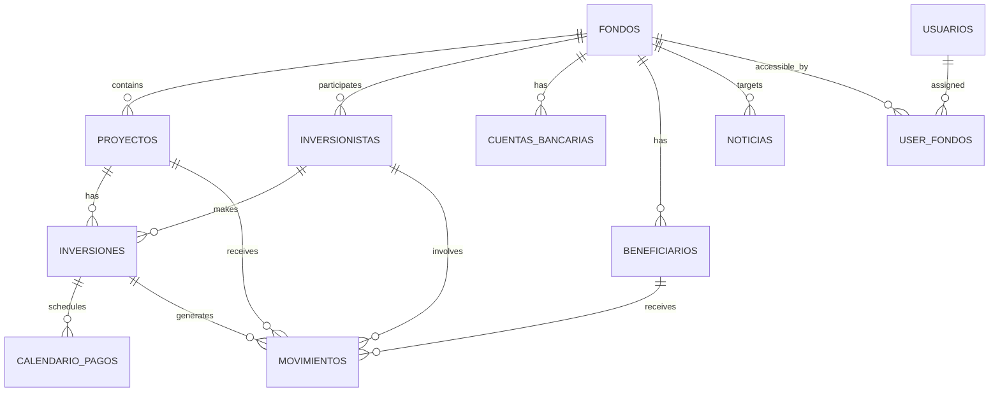
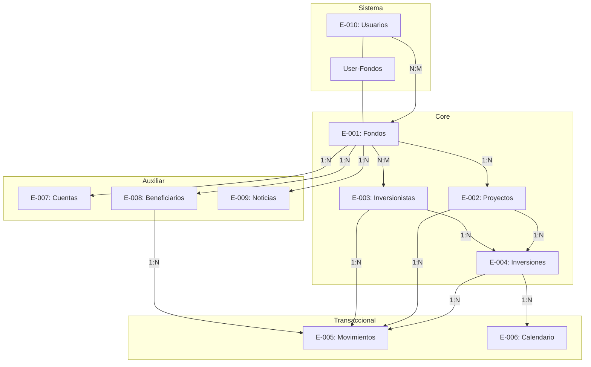

# 🗄️ Data Model — Adi Capital Admin

> Generado desde Discovery Brief §4 por `/docs`
> **Fuente:** `docs/planning/00_DISCOVERY_BRIEFING.md`
> **SSOT:** `lib/db/schema/*` (cuando se implemente)

---

## Diagrama ER



---

## Entidades

### E-001: Fondos

> Vehículo de inversión que contiene proyectos e inversionistas.

```typescript
// lib/db/schema/fondos.ts
import { pgTable, text, timestamp, pgEnum } from 'drizzle-orm/pg-core';

export const metodoCascadaEnum = pgEnum('metodo_cascada', [
  'pref_primero',
  'capital_primero'
]);

export const monedaEnum = pgEnum('moneda', ['MXN', 'USD', 'EUR', 'ILS']);

export const fondos = pgTable('fondos', {
  id: text('id').primaryKey().$defaultFn(() => createId()),
  nombre: text('nombre').notNull().unique(),
  slug: text('slug').notNull().unique(),
  monedaBase: monedaEnum('moneda_base').notNull().default('USD'),
  metodoCascada: metodoCascadaEnum('metodo_cascada').notNull().default('pref_primero'),

  // Cached (calculado desde movimientos)
  capitalSocios: text('capital_socios').default('0'), // Decimal as string

  // Auditoría
  createdAt: timestamp('created_at').defaultNow().notNull(),
  updatedAt: timestamp('updated_at').defaultNow().notNull(),
});
```

**Índices:**
- `UNIQUE(slug)`
- `UNIQUE(nombre)`

**Reglas relacionadas:** BR-002, BR-003

---

### E-002: Proyectos

> Inversión inmobiliaria o empresarial donde el fondo coloca capital.

```typescript
// lib/db/schema/proyectos.ts
import { pgTable, text, timestamp, boolean, decimal, pgEnum } from 'drizzle-orm/pg-core';

export const estadoProyectoEnum = pgEnum('estado_proyecto', [
  'inversion_abierta',
  'inversion_cerrada',
  'concluido'
]);

export const proyectos = pgTable('proyectos', {
  id: text('id').primaryKey().$defaultFn(() => createId()),
  fondoId: text('fondo_id').notNull().references(() => fondos.id),

  codigo: text('codigo').notNull(),
  nombre: text('nombre').notNull(),
  descripcion: text('descripcion'),
  estado: estadoProyectoEnum('estado').notNull().default('inversion_abierta'),

  // Configuración financiera
  tasaPref: decimal('tasa_pref', { precision: 5, scale: 2 }).notNull().default('12.00'),
  successFeePorcentaje: decimal('success_fee_porcentaje', { precision: 5, scale: 2 }).notNull().default('20.00'),
  metodoCascada: metodoCascadaEnum('metodo_cascada'), // NULL = hereda de fondo

  // Hurdle (para otros clientes, post-MVP)
  tieneHurdle: boolean('tiene_hurdle').default(false),
  tasaHurdle: decimal('tasa_hurdle', { precision: 5, scale: 2 }),

  // Fechas
  fechaInicio: timestamp('fecha_inicio'),
  fechaTerminacion: timestamp('fecha_terminacion'),

  // Drive integration
  docsFolderId: text('docs_folder_id'),
  heroImageId: text('hero_image_id'),
  heroImageUrl: text('hero_image_url'),

  // Flags
  oportunidadInversion: boolean('oportunidad_inversion').default(true),
  portafolio: boolean('portafolio').default(false),

  // Auditoría
  createdAt: timestamp('created_at').defaultNow().notNull(),
  updatedAt: timestamp('updated_at').defaultNow().notNull(),
});
```

**Índices:**
- `UNIQUE(fondo_id, codigo)`
- `INDEX(fondo_id)`
- `INDEX(estado)`

**Reglas relacionadas:** BR-004 → BR-009

---

### E-003: Inversionistas

> Persona que invierte capital en proyectos de los fondos.

```typescript
// lib/db/schema/inversionistas.ts
import { pgTable, text, timestamp, boolean, decimal } from 'drizzle-orm/pg-core';

export const inversionistas = pgTable('inversionistas', {
  id: text('id').primaryKey().$defaultFn(() => createId()),

  nombre: text('nombre').notNull(),
  email: text('email').notNull().unique(),
  telefono: text('telefono'),

  // Fundador/Socio
  esFundador: boolean('es_fundador').default(false),
  porcentajePropiedad: decimal('porcentaje_propiedad', { precision: 5, scale: 2 }),

  // Agente asignado
  agenteId: text('agente_id'),
  agenteMail: text('agente_mail'),

  // Drive integration
  docsFolderId: text('docs_folder_id'),

  // Auditoría
  createdAt: timestamp('created_at').defaultNow().notNull(),
  updatedAt: timestamp('updated_at').defaultNow().notNull(),
});

// Relación N:M con Fondos
export const inversionistasFondos = pgTable('inversionistas_fondos', {
  id: text('id').primaryKey().$defaultFn(() => createId()),
  inversionistaId: text('inversionista_id').notNull().references(() => inversionistas.id),
  fondoId: text('fondo_id').notNull().references(() => fondos.id),
  createdAt: timestamp('created_at').defaultNow().notNull(),
});
```

**Índices:**
- `UNIQUE(email)`
- `UNIQUE(inversionista_id, fondo_id)` en tabla relación
- `INDEX(es_fundador)`

**Reglas relacionadas:** BR-010 → BR-012

---

### E-004: Inversiones

> Participación de un inversionista en un proyecto específico.

```typescript
// lib/db/schema/inversiones.ts
import { pgTable, text, timestamp, decimal, pgEnum } from 'drizzle-orm/pg-core';

export const adminFeeTipoEnum = pgEnum('admin_fee_tipo', ['one_time', 'anual']);
export const adminFeeMetodoEnum = pgEnum('admin_fee_metodo', [
  'capital_call_independiente',
  'incluido_en_capital_call'
]);
export const adminFeeBaseEnum = pgEnum('admin_fee_base', ['compromiso', 'aportado']);
export const adminFeePresentacionEnum = pgEnum('admin_fee_presentacion', ['desglosado', 'integrado']);

export const inversiones = pgTable('inversiones', {
  id: text('id').primaryKey().$defaultFn(() => createId()),

  inversionistaId: text('inversionista_id').notNull().references(() => inversionistas.id),
  proyectoId: text('proyecto_id').notNull().references(() => proyectos.id),

  codigo: text('codigo').notNull().unique(),
  compromiso: decimal('compromiso', { precision: 18, scale: 2 }).notNull(),

  // Campos cached (calculados desde movimientos)
  capitalAportado: decimal('capital_aportado', { precision: 18, scale: 2 }).default('0'),
  prefAcumulado: decimal('pref_acumulado', { precision: 18, scale: 2 }).default('0'),
  prefPagado: decimal('pref_pagado', { precision: 18, scale: 2 }).default('0'),

  // Config Admin Fee
  adminFeeTipo: adminFeeTipoEnum('admin_fee_tipo').default('one_time'),
  adminFeePorcentaje: decimal('admin_fee_porcentaje', { precision: 5, scale: 2 }).default('0'),
  adminFeeMetodo: adminFeeMetodoEnum('admin_fee_metodo'),
  adminFeePresentacion: adminFeePresentacionEnum('admin_fee_presentacion'),
  adminFeeBase: adminFeeBaseEnum('admin_fee_base').default('compromiso'),
  adminFeeSaldo: decimal('admin_fee_saldo', { precision: 18, scale: 2 }).default('0'),

  // Config Pref (override de proyecto)
  configPref: text('config_pref'), // JSON si hay override

  // Notas
  notas: text('notas'),

  // Fecha última acumulación de Pref
  prefAcumuladoHasta: timestamp('pref_acumulado_hasta'),

  // Auditoría
  createdAt: timestamp('created_at').defaultNow().notNull(),
  updatedAt: timestamp('updated_at').defaultNow().notNull(),
});
```

**Índices:**
- `UNIQUE(codigo)`
- `INDEX(inversionista_id)`
- `INDEX(proyecto_id)`
- `UNIQUE(inversionista_id, proyecto_id)` — un inversionista solo puede tener una inversión por proyecto

**Reglas relacionadas:** BR-013 → BR-017

---

### E-005: Movimientos

> Transacción financiera del sistema (18 tipos).

```typescript
// lib/db/schema/movimientos.ts
import { pgTable, text, timestamp, decimal, boolean, pgEnum } from 'drizzle-orm/pg-core';

export const conceptoEnum = pgEnum('concepto', [
  // Inversionistas
  'APO', 'APO-D', 'DIS', 'DEV', 'FEE',
  // Proyectos
  'INV', 'INV-D', 'RET',
  // Gastos
  'GAS', 'GASP',
  // Socios
  'APS', 'RPS', 'PRS', 'DPRS',
  // Administración
  'TRA', 'CAM', 'ERR', 'TSI'
]);

export const estadoMovimientoEnum = pgEnum('estado_movimiento', [
  'borrador',
  'confirmado',
  'cancelado'
]);

export const movimientos = pgTable('movimientos', {
  id: text('id').primaryKey().$defaultFn(() => createId()),

  // Contexto
  fondoId: text('fondo_id').notNull().references(() => fondos.id),
  proyectoId: text('proyecto_id').references(() => proyectos.id),
  inversionistaId: text('inversionista_id').references(() => inversionistas.id),
  inversionId: text('inversion_id').references(() => inversiones.id),
  beneficiarioId: text('beneficiario_id').references(() => beneficiarios.id),
  cuentaId: text('cuenta_id').references(() => cuentasBancarias.id),

  // Datos del movimiento
  concepto: conceptoEnum('concepto').notNull(),
  monto: decimal('monto', { precision: 18, scale: 2 }).notNull(),
  moneda: monedaEnum('moneda').notNull(),
  tipoCambio: decimal('tipo_cambio', { precision: 10, scale: 4 }),
  montoUsd: decimal('monto_usd', { precision: 18, scale: 2 }), // Convertido

  // Estado
  estado: estadoMovimientoEnum('estado').notNull().default('borrador'),

  // Fechas
  fechaMovimiento: timestamp('fecha_movimiento').notNull(),
  fechaConfirmacion: timestamp('fecha_confirmacion'),

  // Agrupación
  grupoMovimiento: text('grupo_movimiento'), // UUID para operaciones multi-línea

  // Descripción
  descripcion: text('descripcion'),

  // Sync tracking
  sincronizadoFirebase: boolean('sincronizado_firebase').default(false),

  // Auditoría
  createdBy: text('created_by'),
  createdAt: timestamp('created_at').defaultNow().notNull(),
  updatedAt: timestamp('updated_at').defaultNow().notNull(),
});
```

**Índices:**
- `INDEX(fondo_id)`
- `INDEX(proyecto_id)`
- `INDEX(inversionista_id)`
- `INDEX(inversion_id)`
- `INDEX(concepto)`
- `INDEX(estado)`
- `INDEX(fecha_movimiento)`
- `INDEX(sincronizado_firebase) WHERE sincronizado_firebase = false`
- `INDEX(grupo_movimiento)`

**Reglas relacionadas:** BR-020 → BR-029

---

### E-006: Calendario de Pagos

> Capital calls programados para una inversión.

```typescript
// lib/db/schema/calendario-pagos.ts
import { pgTable, text, timestamp, decimal, integer, pgEnum } from 'drizzle-orm/pg-core';

export const estadoCallEnum = pgEnum('estado_call', ['pendiente', 'parcial', 'completo']);

export const calendarioPagos = pgTable('calendario_pagos', {
  id: text('id').primaryKey().$defaultFn(() => createId()),

  inversionId: text('inversion_id').notNull().references(() => inversiones.id),

  numero: integer('numero').notNull(), // Secuencial por inversión
  fechaProgramada: timestamp('fecha_programada').notNull(),
  montoEsperado: decimal('monto_esperado', { precision: 18, scale: 2 }).notNull(),
  montoPagado: decimal('monto_pagado', { precision: 18, scale: 2 }).default('0'),
  estado: estadoCallEnum('estado').notNull().default('pendiente'),

  // Auditoría
  createdAt: timestamp('created_at').defaultNow().notNull(),
  updatedAt: timestamp('updated_at').defaultNow().notNull(),
});
```

**Índices:**
- `INDEX(inversion_id)`
- `UNIQUE(inversion_id, numero)`

**Reglas relacionadas:** BR-018

---

### E-007: Cuentas Bancarias

> Cuentas del fondo para recibir/enviar dinero.

```typescript
// lib/db/schema/cuentas-bancarias.ts
import { pgTable, text, timestamp, decimal, boolean } from 'drizzle-orm/pg-core';

export const cuentasBancarias = pgTable('cuentas_bancarias', {
  id: text('id').primaryKey().$defaultFn(() => createId()),

  fondoId: text('fondo_id').notNull().references(() => fondos.id),

  banco: text('banco').notNull(),
  numero: text('numero').notNull(),
  clabe: text('clabe'),
  moneda: monedaEnum('moneda').notNull(),

  // Cached
  saldo: decimal('saldo', { precision: 18, scale: 2 }).default('0'),

  activa: boolean('activa').default(true),

  // Auditoría
  createdAt: timestamp('created_at').defaultNow().notNull(),
  updatedAt: timestamp('updated_at').defaultNow().notNull(),
});
```

**Índices:**
- `INDEX(fondo_id)`
- `UNIQUE(fondo_id, numero)`

---

### E-008: Beneficiarios

> Receptores de pagos de gastos.

```typescript
// lib/db/schema/beneficiarios.ts
import { pgTable, text, timestamp } from 'drizzle-orm/pg-core';

export const beneficiarios = pgTable('beneficiarios', {
  id: text('id').primaryKey().$defaultFn(() => createId()),

  fondoId: text('fondo_id').notNull().references(() => fondos.id),

  nombre: text('nombre').notNull(),
  banco: text('banco'),
  numeroCuenta: text('numero_cuenta'),
  clabe: text('clabe'),

  // Auditoría
  createdAt: timestamp('created_at').defaultNow().notNull(),
  updatedAt: timestamp('updated_at').defaultNow().notNull(),
});
```

**Índices:**
- `INDEX(fondo_id)`
- `UNIQUE(fondo_id, nombre)`

**Reglas relacionadas:** BR-019

---

### E-009: Noticias

> Comunicados para la app de inversionistas.

```typescript
// lib/db/schema/noticias.ts
import { pgTable, text, timestamp, boolean } from 'drizzle-orm/pg-core';

export const noticias = pgTable('noticias', {
  id: text('id').primaryKey().$defaultFn(() => createId()),

  fondoId: text('fondo_id').references(() => fondos.id), // NULL = general

  titulo: text('titulo').notNull(),
  contenido: text('contenido'),
  link: text('link'),
  imageUrl: text('image_url'),

  publicado: boolean('publicado').default(false),
  fechaPublicacion: timestamp('fecha_publicacion'),

  // Sync tracking
  sincronizadoFirebase: boolean('sincronizado_firebase').default(false),

  // Auditoría
  createdAt: timestamp('created_at').defaultNow().notNull(),
  updatedAt: timestamp('updated_at').defaultNow().notNull(),
});
```

**Índices:**
- `INDEX(fondo_id)`
- `INDEX(publicado)`
- `INDEX(sincronizado_firebase) WHERE sincronizado_firebase = false`

---

### E-010: Usuarios (Existente en Starter Kit)

> Usuarios del sistema admin (extiende schema existente).

```typescript
// lib/db/schema/users.ts (extender existente)
import { pgEnum } from 'drizzle-orm/pg-core';

export const rolUsuarioEnum = pgEnum('rol_usuario', [
  'super_admin',
  'admin_fondo',
  'agente' // Post-MVP
]);

// Agregar campo a users existente:
// rol: rolUsuarioEnum('rol').notNull().default('admin_fondo')

// Tabla de asignación de fondos
export const userFondos = pgTable('user_fondos', {
  id: text('id').primaryKey().$defaultFn(() => createId()),
  userId: text('user_id').notNull().references(() => users.id),
  fondoId: text('fondo_id').notNull().references(() => fondos.id),
  createdAt: timestamp('created_at').defaultNow().notNull(),
});
```

**Índices:**
- `UNIQUE(user_id, fondo_id)`
- `INDEX(user_id)`
- `INDEX(fondo_id)`

---

## Relaciones Completas



---

## Campos Calculados (Cached)

| Entidad | Campo | Calculado desde | Regla |
|---------|-------|-----------------|-------|
| `fondos` | `capital_socios` | SUM(APS - RPS) confirmados | BR-001 |
| `inversiones` | `capital_aportado` | SUM(APO) - SUM(DEV) confirmados | BR-031 |
| `inversiones` | `pref_acumulado` | Cálculo diario | BR-030 |
| `inversiones` | `pref_pagado` | SUM(DIS a Pref) confirmados | BR-032 |
| `cuentas_bancarias` | `saldo` | Balance de movimientos | — |

---

## Enums Compartidos

```typescript
// lib/db/schema/enums.ts
export const monedaEnum = pgEnum('moneda', ['MXN', 'USD', 'EUR', 'ILS']);

export const metodoCascadaEnum = pgEnum('metodo_cascada', [
  'pref_primero',
  'capital_primero'
]);

export const conceptoEnum = pgEnum('concepto', [
  'APO', 'APO-D', 'DIS', 'DEV', 'FEE',
  'INV', 'INV-D', 'RET',
  'GAS', 'GASP',
  'APS', 'RPS', 'PRS', 'DPRS',
  'TRA', 'CAM', 'ERR', 'TSI'
]);

export const estadoMovimientoEnum = pgEnum('estado_movimiento', [
  'borrador', 'confirmado', 'cancelado'
]);
```

---

## Migration Plan

1. **Fase 1:** Crear schemas base (fondos, proyectos, inversionistas)
2. **Fase 2:** Crear inversiones y calendario
3. **Fase 3:** Crear movimientos con enums
4. **Fase 4:** Crear auxiliares (cuentas, beneficiarios, noticias)
5. **Fase 5:** Extender users con roles y asignaciones

---

## Open Questions

| # | Pregunta | Impacto | Owner |
|---|----------|---------|-------|
| OQ-01 | ¿Usar soft-delete o hard-delete para entidades? | **Alto** | Dev/Architect |
| OQ-02 | ¿Precision de decimales (18,2) es suficiente para montos grandes? | Med | Dev |
| OQ-03 | ¿Guardar historial de cambios en tabla audit_log? | **Alto** | Dev/Cliente |

---

## Assumptions

| # | Supuesto | Si es incorrecto |
|---|----------|------------------|
| A-01 | Usamos CUID para IDs (como el Starter Kit) | Impacto: Cambiar función de generación |
| A-02 | Los montos se almacenan como decimal(18,2) en strings | Impacto: Revisar precisión |
| A-03 | No se requiere multi-tenant más allá de fondos | Impacto: Agregar tenant_id a todas las tablas |

---

*Generado por TimeKast Factory — /docs*
