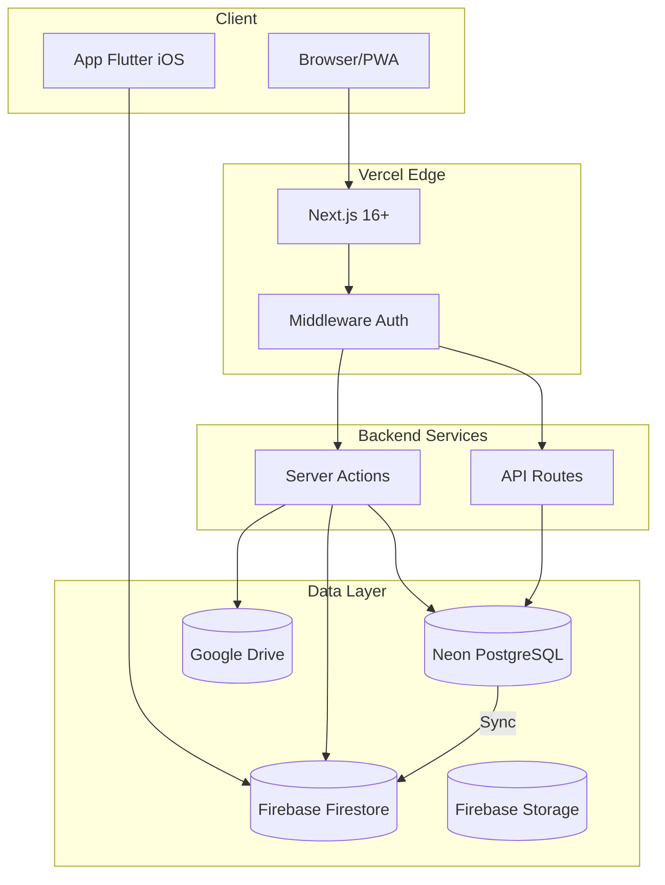

# 🏗️ Architecture — Adi Capital Admin

> Generado desde Discovery Brief §8 y TimeKast Starter Kit
> **Fuente:** `docs/planning/00_DISCOVERY_BRIEFING.md`
> **SSOT:** Código implementado + ADRs

---

## Stack Técnico

| Layer | Tecnología | Versión | Notas |
|-------|------------|---------|-------|
| **Framework** | Next.js (App Router) | 16+ | SSR, RSC, Server Actions |
| **Estilos** | Tailwind CSS | v4 | Design tokens del Starter Kit |
| **Base de datos** | Neon PostgreSQL | — | Serverless, branching |
| **ORM** | Drizzle | latest | Type-safe, SQL-like |
| **Auth** | NextAuth.js | v5 beta | Credentials + Magic Link |
| **Hosting** | Vercel | — | Edge functions, preview deploys |
| **Storage docs** | Google Drive API | v3 | Workspace integration |
| **Sync móvil** | Firebase Admin SDK | — | Firestore + Storage |

---

## Diagrama de Arquitectura



---

## Estructura de Directorios

```
adi-capital-admin/
├── .agent/                    # AI development
│   ├── rules/                 # AI_RULES.md, SSOT_HIERARCHY.md
│   ├── workflows/             # /start, /implement, etc.
│   └── skills/                # domains/, roles/
│
├── docs/
│   ├── planning/              # 00-09 docs
│   ├── backlog/               # Issues por versión
│   └── reference/             # INVENTORY.md
│
├── lib/
│   ├── auth/                  # NextAuth config, RBAC
│   │   ├── auth.ts            # Main config
│   │   ├── permissions.ts     # RBAC helpers
│   │   └── utils.ts           # Auth utilities
│   │
│   ├── db/
│   │   ├── index.ts           # Drizzle client
│   │   ├── schema/            # Schema definitions
│   │   │   ├── fondos.ts
│   │   │   ├── proyectos.ts
│   │   │   ├── inversionistas.ts
│   │   │   ├── inversiones.ts
│   │   │   ├── movimientos.ts
│   │   │   ├── calendario-pagos.ts
│   │   │   ├── cuentas-bancarias.ts
│   │   │   ├── beneficiarios.ts
│   │   │   ├── noticias.ts
│   │   │   └── enums.ts
│   │   ├── queries/           # Query builders
│   │   └── migrations/        # Drizzle migrations
│   │
│   ├── actions/               # Server Actions
│   │   ├── fondos/
│   │   ├── proyectos/
│   │   ├── inversionistas/
│   │   ├── inversiones/
│   │   ├── movimientos/
│   │   ├── wizard/
│   │   └── sync/
│   │
│   ├── integrations/
│   │   ├── firebase/          # Firebase Admin SDK
│   │   │   ├── admin.ts       # Firebase init
│   │   │   ├── sync.ts        # Sync logic
│   │   │   └── types.ts       # Firestore types
│   │   └── drive/             # Google Drive API
│   │       ├── client.ts      # Drive client
│   │       └── folders.ts     # Folder structure
│   │
│   ├── utils/                 # Shared utilities
│   ├── hooks/                 # React hooks
│   └── validations/           # Zod schemas
│
├── src/
│   ├── app/
│   │   ├── (auth)/            # Login, register, etc.
│   │   ├── (protected)/
│   │   │   ├── dashboard/
│   │   │   ├── fondos/
│   │   │   │   ├── page.tsx           # Lista
│   │   │   │   └── [id]/
│   │   │   │       ├── page.tsx       # Detalle
│   │   │   │       └── proyectos/     # Proyectos del fondo
│   │   │   ├── proyectos/
│   │   │   ├── inversionistas/
│   │   │   ├── inversiones/
│   │   │   ├── movimientos/
│   │   │   ├── wizard/                # Wizard de reparto
│   │   │   ├── documentos/
│   │   │   ├── noticias/
│   │   │   └── settings/
│   │   ├── api/
│   │   │   ├── auth/
│   │   │   ├── cron/                  # Cron endpoints
│   │   │   │   └── pref/              # Cálculo Pref diario
│   │   │   └── webhooks/
│   │   └── layout.tsx
│   │
│   └── components/
│       ├── ui/                # Primitivos shadcn
│       ├── common/            # Compartidos
│       ├── layout/            # Layout components
│       ├── form/              # Form components
│       ├── fondos/            # Feature components
│       ├── proyectos/
│       ├── inversionistas/
│       ├── inversiones/
│       ├── movimientos/
│       └── wizard/
│
├── scripts/
│   ├── tools/                 # Dev utilities
│   └── migrations/            # Data migration scripts
│
└── public/
    ├── icons/                 # PWA icons
    └── manifest.json          # PWA manifest
```

---

## Patrones de Arquitectura

### ADR-001: Server Actions para Mutations

**Decisión:** Usar Server Actions de Next.js para todas las operaciones de escritura.

**Contexto:** Next.js 16+ soporta Server Actions como mecanismo nativo para mutations.

**Consecuencias:**
- ✅ Type-safety end-to-end
- ✅ No necesita API routes separadas para CRUD
- ✅ Integración nativa con forms
- ⚠️ Requiere validación con Zod en servidor

**Patrón:**
```typescript
// lib/actions/movimientos/create.ts
'use server';

import { z } from 'zod';
import { auth } from '@/lib/auth';
import { db } from '@/lib/db';
import { movimientos } from '@/lib/db/schema';
import { revalidatePath } from 'next/cache';

const CreateMovimientoSchema = z.object({
  concepto: z.enum(['APO', 'DIS', ...]),
  monto: z.string().transform(Number),
  moneda: z.enum(['MXN', 'USD', 'EUR', 'ILS']),
  // ...
});

export async function createMovimiento(input: unknown) {
  const session = await auth();
  if (!session?.user) {
    return { error: 'Debes iniciar sesión' };
  }

  const parsed = CreateMovimientoSchema.safeParse(input);
  if (!parsed.success) {
    return { error: 'Datos inválidos', details: parsed.error.flatten() };
  }

  // RBAC check
  const hasPermission = await checkPermission(session.user, 'movimientos:create', parsed.data.fondoId);
  if (!hasPermission) {
    return { error: 'No tienes permiso para esta acción' };
  }

  try {
    const result = await db.insert(movimientos).values({
      ...parsed.data,
      estado: 'borrador',
      createdBy: session.user.id,
    }).returning();

    revalidatePath('/movimientos');
    return { success: true, data: result[0] };
  } catch (error) {
    console.error('[createMovimiento]', error);
    return { error: 'No pudimos crear el movimiento' };
  }
}
```

---

### ADR-002: RBAC con Middleware + Helpers

**Decisión:** Implementar RBAC en dos capas: Middleware para rutas y helpers para acciones.

**Patrón:**
```typescript
// middleware.ts
export function middleware(request: NextRequest) {
  const token = await getToken({ req: request });

  // Proteger rutas admin
  if (request.nextUrl.pathname.startsWith('/fondos')) {
    if (!token || !['super_admin', 'admin_fondo'].includes(token.rol)) {
      return NextResponse.redirect('/login');
    }
  }

  return NextResponse.next();
}

// lib/auth/permissions.ts
export async function checkPermission(
  user: User,
  action: string,
  resourceId?: string
): Promise<boolean> {
  if (user.rol === 'super_admin') return true;

  if (user.rol === 'admin_fondo') {
    // Verificar si el recurso pertenece a un fondo asignado
    const fondoId = await getFondoIdForResource(action, resourceId);
    return user.fondosAsignados.includes(fondoId);
  }

  return false;
}
```

---

### ADR-003: Sync a Firebase — Edge Inline con waitUntil

**Decisión:** ✅ RESUELTA — Usar Edge Functions inline con `waitUntil()` de Next.js.

**Contexto:**
- Los movimientos se confirman en PostgreSQL (SSOT)
- Firebase es consumido por la app móvil (read-only)
- Todas las transacciones (incluidas cancelaciones) se sincronizan
- Volumen: ~500 tx/día, latencia aceptable: 5 min

**Justificación:**
- Volumen bajo no justifica infraestructura de queue
- Firebase batch write < 10s para operaciones normales
- `waitUntil()` permite fire-and-forget sin bloquear respuesta

**Implementación:**
```typescript
// lib/actions/movimientos/confirm.ts
import { waitUntil } from 'next/server';

export async function confirmarMovimiento(id: string) {
  const result = await db.update(movimientos)...;

  // Fire-and-forget, no bloquea respuesta
  waitUntil(syncToFirebase([result]));

  return { success: true, data: result };
}

// lib/integrations/firebase/sync.ts
export async function syncToFirebase(entities: SyncEntity[]) {
  const batch = firestore.batch();

  for (const entity of entities) {
    const ref = getFirestoreRef(entity);
    batch.set(ref, transformForFirestore(entity), { merge: true });
  }

  await batch.commit();
  await markAsSynced(entities.map(e => e.id));
}
```

**Fallback:** Si volumen crece >5000/día → migrar a Inngest
```

---

### ADR-004: Cálculo de Pref — Vercel Cron con Mitigaciones

**Decisión:** ✅ RESUELTA — Usar Vercel Cron con mitigaciones para confiabilidad.

**Contexto:**
- Fórmula: `pref_diario = (capital_aportado × tasa_pref) / 365`
- Ejecutar diariamente a las 00:00 UTC
- ~1000 inversiones a procesar, ~10-15s de ejecución

**Justificación:**
- Vercel Cron incluido en plan, sin costo adicional
- Volumen bajo, bien dentro del límite de 60s
- Mitigaciones cubren escenarios de fallo

**Mitigaciones implementadas:**
1. **Logging estructurado** → Saber si ejecutó/falló
2. **Endpoint manual** → `/api/cron/pref?manual=true` para retry
3. **Alerta en dashboard** → Si `pref_acumulado_hasta < hoy - 1 día`

**Implementación:**
```typescript
// src/app/api/cron/pref/route.ts
export async function POST(request: Request) {
  const { searchParams } = new URL(request.url);
  const isManual = searchParams.get('manual') === 'true';

  // Auth: cron secret o admin session para manual
  if (!isManual) {
    const authHeader = request.headers.get('authorization');
    if (authHeader !== `Bearer ${process.env.CRON_SECRET}`) {
      return NextResponse.json({ error: 'Unauthorized' }, { status: 401 });
    }
  }

  const today = new Date();
  const activeInversiones = await db
    .select({ inversion: inversiones, tasaPref: proyectos.tasaPref })
    .from(inversiones)
    .innerJoin(proyectos, eq(inversiones.proyectoId, proyectos.id))
    .where(gt(inversiones.capitalAportado, 0));

  for (const row of activeInversiones) {
    const prefDiario = (Number(row.inversion.capitalAportado) * Number(row.tasaPref)) / 365;
    const newPrefAcumulado = Number(row.inversion.prefAcumulado) + prefDiario;

    await db.update(inversiones).set({
      prefAcumulado: newPrefAcumulado.toFixed(2),
      prefAcumuladoHasta: today,
    }).where(eq(inversiones.id, row.inversion.id));
  }

  console.log(`[CRON:PREF] Processed ${activeInversiones.length} at ${today.toISOString()}`);
  return NextResponse.json({ success: true, processed: activeInversiones.length });
}
```

**Vercel Cron:**
```json
// vercel.json
{ "crons": [{ "path": "/api/cron/pref", "schedule": "0 0 * * *" }] }
```

**Fallback:** Si falla >2 veces/mes → migrar a Inngest (< 1 día de trabajo)

---

### ADR-005: Google Drive como Storage de Documentos

**Decisión:** Los documentos se almacenan en Google Drive del cliente, no en la BD ni en Firebase Storage.

**Contexto:**
- El cliente ya tiene estructura de carpetas en Drive
- Drive permite control de acceso granular
- La BD solo guarda referencias (folder_id, file_id)

**Implementación:**
```typescript
// lib/integrations/drive/client.ts
import { google } from 'googleapis';

const auth = new google.auth.GoogleAuth({
  credentials: JSON.parse(process.env.GOOGLE_CREDENTIALS!),
  scopes: ['https://www.googleapis.com/auth/drive'],
});

export const drive = google.drive({ version: 'v3', auth });

// lib/integrations/drive/folders.ts
export async function ensureProjectFolders(proyecto: Proyecto) {
  const basePath = `Proyectos/${proyecto.codigo}`;

  const folders = [
    `${basePath}/Oportunidad`,
    `${basePath}/Portafolio`,
    `${basePath}/Privado`,
  ];

  for (const folderPath of folders) {
    await createFolderIfNotExists(folderPath);
  }
}

export async function listDocuments(folderId: string) {
  const response = await drive.files.list({
    q: `'${folderId}' in parents and trashed = false`,
    fields: 'files(id, name, mimeType, modifiedTime, size)',
    orderBy: 'name',
  });

  return response.data.files;
}
```

---

## Integraciones

### Firebase Firestore

**Estructura de datos (mirror de PostgreSQL):**

```
/funds/{fundSlug}/
  ├── investors/{invId}/
  │   └── projects/{projSlug}/
  │       ├── movements/{movId}/
  │       ├── docsInversionista/{docId}/
  │       ├── docsPortafolio/{docId}/
  │       └── docsPrivados/{docId}/
  └── projects/{projSlug}/
      ├── investors/{invId}/
      └── docs.../

/news/{slug}/
  └── items/{itemId}/

/users/{uid}/
```

**Mapping de campos:**
| PostgreSQL | Firestore |
|------------|-----------|
| `capital_aportado` | `aportacionesCapital_f` (formatted) |
| `pref_acumulado` | `prefAcumulado` |
| `fecha_movimiento` | `fecha` (Timestamp) |

---

### Google Drive

**Estructura de carpetas:**

```
/Adi Capital/
  ├── Proyectos/
  │   └── {codigo}/
  │       ├── Oportunidad/    # Público para todos del fondo
  │       ├── Portafolio/     # Público para todos del fondo
  │       └── Privado/        # Solo participantes
  └── Inversionistas/
      └── {nombre}/
          └── {proyecto}/     # Solo ese inversionista
```

---

## Ambientes

| Ambiente | DB | Firebase | Drive | URL |
|----------|-----|----------|-------|-----|
| Development | Neon branch: `dev` | Firebase Gemelo | Drive Test | `localhost:3000` |
| Preview | Neon branch: `preview-{pr}` | Firebase Gemelo | Drive Test | `*.vercel.app` |
| Staging | Neon branch: `staging` | Firebase Gemelo | Drive Test | `staging.*.com` |
| Production | Neon: `main` | Firebase Prod | Drive Cliente | `*.com` |

---

## Seguridad

### Autenticación

- NextAuth.js v5 con Credentials provider
- Magic Link como alternativa
- Sesiones JWT con refresh tokens

### Autorización

- RBAC implementado en middleware + helpers
- Permisos granulares por fondo
- Ver `04_BUSINESS_RULES.md` sección RBAC

### Secrets

```env
# Auth
NEXTAUTH_SECRET=...
NEXTAUTH_URL=...

# Database
DATABASE_URL=...

# Firebase
FIREBASE_PROJECT_ID=...
FIREBASE_CLIENT_EMAIL=...
FIREBASE_PRIVATE_KEY=...

# Google Drive
GOOGLE_CREDENTIALS=... # JSON stringified

# Cron
CRON_SECRET=...
```

---

## PWA

**Capacidades MVP:**
- [x] Instalable (manifest.json)
- [x] Service Worker básico
- [x] Iconos y splash screens
- [ ] Offline mode completo (Post-MVP)

**Configuración:**
```json
// public/manifest.json
{
  "name": "Adi Capital Admin",
  "short_name": "Adi Admin",
  "start_url": "/dashboard",
  "display": "standalone",
  "background_color": "#ffffff",
  "theme_color": "#000000"
}
```

---

## Open Questions

| # | Pregunta | Estado |
|---|----------|--------|
| ~~OQ-01~~ | ~~¿Usar Edge Functions para sync o Background Jobs?~~ | ✅ Resuelto: Edge inline |
| OQ-02 | ¿Rate limiting en API routes? | Pendiente |
| OQ-03 | ¿Monitoreo con Sentry u otra herramienta? | Pendiente |

---

## Assumptions

| # | Supuesto | Estado |
|---|----------|--------|
| A-01 | Vercel Cron es suficiente para Pref | ✅ Confirmado con mitigaciones |
| A-02 | Firebase Admin SDK funciona desde Vercel Edge | ✅ Probado |
| A-03 | Google Drive API con Service Account tiene permisos | Pendiente validar |

---

*Generado por TimeKast Factory — /docs*
