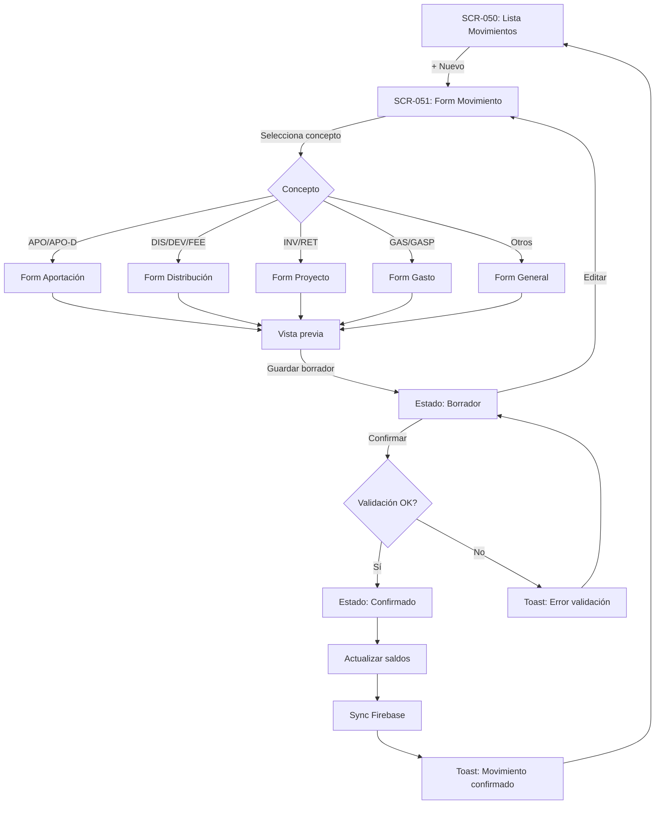
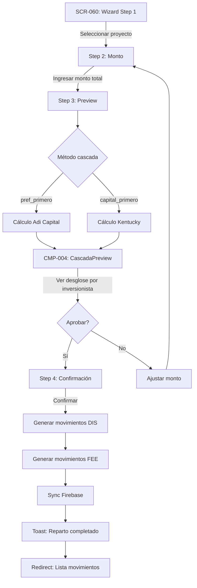
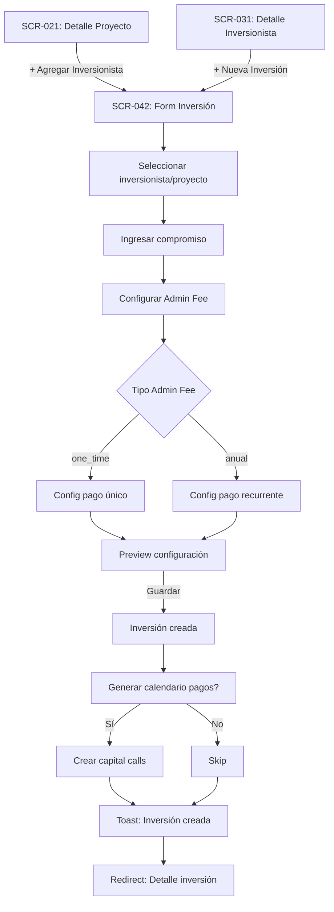
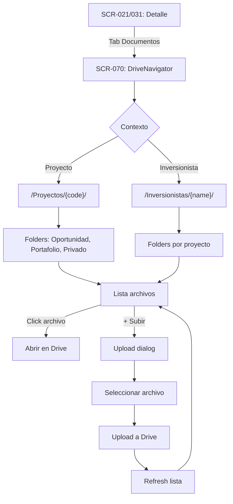

# 🎨 Design Specification — Adi Capital Admin

> Generado desde Discovery Brief y Docs por `/design`
> **Fuente:** docs/planning/00-08
> **SSOT:** Este doc → código UI
> **Base:** TimeKast Starter Kit (Auth, Layout, Tables, Forms ya implementados)

---

## 📱 Mapa de Pantallas

### Pantallas Existentes (Starter Kit)

| ID | Pantalla | URL | Estado |
|----|----------|-----|--------|
| SK-001 | Login | `/login` | ✅ Implementado |
| SK-002 | Register | `/register` | ✅ Implementado |
| SK-003 | Forgot Password | `/forgot-password` | ✅ Implementado |
| SK-004 | Reset Password | `/reset-password` | ✅ Implementado |
| SK-005 | Accept Invite | `/accept-invite` | ✅ Implementado |
| SK-006 | User Profile | `/settings/profile` | ✅ Implementado |
| SK-007 | User Management | `/settings/users` | ✅ Implementado |

### Pantallas Nuevas (A Implementar)

| ID | Pantalla | URL | Propósito | Acceso | Stories |
|----|----------|-----|-----------|--------|---------|
| **Dashboard** |
| SCR-001 | Dashboard Overview | `/dashboard` | Resumen de fondos y métricas | P-001, P-002 | US-100-102 |
| **Fondos** |
| SCR-010 | Lista de Fondos | `/fondos` | Listado de fondos según acceso | P-001, P-002 | US-003 |
| SCR-011 | Detalle de Fondo | `/fondos/[id]` | Configuración y proyectos del fondo | P-001, P-002 | US-001-003 |
| SCR-012 | Cuentas Bancarias | Tab en SCR-011 | CRUD cuentas del fondo con saldos | P-001, P-002 | US-022-024 |
| SCR-013 | Beneficiarios | Tab en SCR-011 | CRUD beneficiarios para gastos | P-001, P-002 | US-025-026 |
| **Proyectos** |
| SCR-020 | Lista de Proyectos | `/fondos/[fondoId]/proyectos` | Proyectos del fondo | P-001, P-002 | US-006 |
| SCR-021 | Detalle de Proyecto | `/fondos/[fondoId]/proyectos/[id]` | Estado financiero y participantes | P-001, P-002 | US-006-008 |
| SCR-022 | Form Proyecto | Dialog en SCR-020/021 | Crear/editar proyecto | P-001, P-002 | US-004-005 |
| **Inversionistas** |
| SCR-030 | Lista de Inversionistas | `/inversionistas` | Todos los inversionistas del fondo | P-001, P-002 | US-011 |
| SCR-031 | Detalle de Inversionista | `/inversionistas/[id]` | Perfil e inversiones | P-001, P-002 | US-012 |
| SCR-032 | Form Inversionista | Dialog en SCR-030/031 | Crear/editar inversionista | P-001, P-002 | US-009-010 |
| **Inversiones** |
| SCR-040 | Lista de Inversiones | Tab en SCR-021 o SCR-031 | Inversiones por proyecto/inversionista | P-001, P-002 | US-017-018 |
| SCR-041 | Detalle de Inversión | `/inversiones/[id]` | Estado del compromiso y movimientos | P-001, P-002 | US-016 |
| SCR-042 | Form Inversión | Dialog | Crear inversión con config fees | P-001, P-002 | US-014-015 |
| SCR-043 | Calendario de Pagos | Tab en SCR-041 | Capital calls programados | P-001, P-002 | US-019-021 |
| **Movimientos** |
| SCR-050 | Lista de Movimientos | `/movimientos` | Todos los movimientos con filtros | P-001, P-002 | US-033 |
| SCR-051 | Form Movimiento | Dialog/Sheet | Registrar movimiento por concepto | P-001, P-002 | US-030-032 |
| SCR-052 | Detalle de Movimiento | Sheet en SCR-050 | Ver detalle completo | P-001, P-002 | US-034 |
| **Wizard** |
| SCR-060 | Wizard de Reparto | `/wizard` | Asistente de distribución multi-step | P-001, P-002 | US-063-067 |
| **Documentos** |
| SCR-070 | Navegador de Documentos | `/documentos` o Tab en SCR-021/031 | Navegación Google Drive | P-001, P-002 | US-080-081 |
| **Noticias** |
| SCR-080 | Lista de Noticias | `/noticias` | Gestión de comunicados | P-001, P-002 | US-095-096 |
| SCR-081 | Form Noticia | Dialog | Crear/editar noticia | P-001, P-002 | US-095 |

**Leyenda de Acceso:**
- `P-001` — Super Admin (todos los fondos)
- `P-002` — Admin de Fondo (solo fondos asignados)

### Wireframes Disponibles

| SCR | Nombre | Wireframe |
|-----|--------|-----------|
| SCR-001 | Dashboard | [Ver wireframe](../wireframes/SCR-001_dashboard.png) |
| SCR-021 | Proyecto Detalle | [Ver wireframe](../wireframes/SCR-021_proyecto_detalle.png) |
| SCR-051 | Form Movimiento | [Ver wireframe](../wireframes/SCR-051_movimiento_form.png) |
| SCR-060 | Wizard Reparto | [Ver wireframe](../wireframes/SCR-060_wizard_reparto.png) |
| SCR-070 | Drive Navigator | [Ver wireframe](../wireframes/SCR-070_drive_navigator.png) |

> 📁 Todos los wireframes: [docs/wireframes/README.md](../wireframes/README.md)

---

## 🧭 Navegación y Sidebar

```
┌─────────────────────────────────────┐
│ [Logo Adi Capital]                   │
├─────────────────────────────────────┤
│ 📊 Dashboard           → P-001, P-002│
│ 💼 Fondos              → P-001, P-002│
│ 👥 Inversionistas      → P-001, P-002│
│ 💰 Movimientos         → P-001, P-002│
│ 🧙 Wizard de Reparto   → P-001, P-002│
│ 📁 Documentos          → P-001, P-002│
│ 📰 Noticias            → P-001, P-002│
├─────────────────────────────────────┤
│ ⚙️ Configuración       → P-001 only  │
│   └─ Usuarios                        │
│   └─ Mi Perfil                       │
├─────────────────────────────────────┤
│ [Avatar] [Nombre Usuario]            │
│          [Logout]                    │
└─────────────────────────────────────┘
```

**Comportamiento:**
- [x] Sidebar colapsable en desktop (ya implementado SK)
- [x] Drawer en mobile (ya implementado SK)
- [x] Indicador de página activa (ya implementado SK)
- [ ] Filtro de fondo activo (nuevo) → CMP-007

---

## 🔄 Flujos Principales

### FLW-001: Registro de Movimiento

**Descripción:** Usuario registra un movimiento financiero, lo confirma y se sincroniza.
**Personas:** P-001, P-002
**Stories:** US-030 → US-035



**Estados:**
- **Happy path:** Crear → Borrador → Confirmar → Sync
- **Error:** Validación falla → Toast error → Corregir
- **Edge case:** Cancelar confirmado → Revertir saldos

---

### FLW-002: Wizard de Reparto

**Descripción:** Usuario ejecuta distribución de capital/utilidades con cálculo automático de cascada.
**Personas:** P-001, P-002
**Stories:** US-063 → US-067



**Estados:**
- **Happy path:** Seleccionar → Calcular → Preview → Confirmar
- **Error:** Proyecto sin inversionistas → Empty state
- **Edge case:** Monto menor a Pref acumulado → Warning

---

### FLW-003: Gestión de Inversión

**Descripción:** Usuario crea una inversión vinculando inversionista con proyecto.
**Personas:** P-001, P-002
**Stories:** US-014 → US-018



---

### FLW-004: Navegación de Documentos

**Descripción:** Usuario navega estructura de Drive y sube documentos.
**Personas:** P-001, P-002
**Stories:** US-080 → US-085



---

## 🧩 Componentes por Pantalla

### SCR-001: Dashboard Overview

**Componentes SK (Reutilizar):**
| Componente | Uso | Variante |
|------------|-----|----------|
| StatsCards | Métricas principales | Adaptar para fondos |
| DataTable | Lista de movimientos recientes | - |
| Card | Contenedores | - |

**Componentes Nuevos:**
| ID | Nombre | Descripción | Prioridad |
|----|--------|-------------|-----------|
| CMP-001 | FundStatsCards | Stats específicos: Capital, Proyectos, Inversionistas | P1 |
| CMP-007 | FundSelector | Dropdown para filtrar por fondo (header) | P1 |

**Estados:**
- [ ] Loading (Skeleton cards + table)
- [ ] Empty (Sin fondos asignados → EmptyState)
- [ ] Con datos

---

### SCR-010/011/012/013: Fondos

**Componentes SK:**
| Componente | Uso |
|------------|-----|
| DataTable | Lista de fondos, cuentas, beneficiarios |
| Card | Detalle del fondo |
| Tabs | Secciones: Proyectos, Cuentas, Beneficiarios |
| Badge | Estado del fondo |
| Dialog | Forms CRUD |

**Tabs en SCR-011:**
| Tab | Contenido | Stories |
|-----|-----------|--------|
| Proyectos | DataTable de proyectos | US-006 |
| Cuentas Bancarias (SCR-012) | DataTable + Form Dialog | US-022-024 |
| Beneficiarios (SCR-013) | DataTable + Form Dialog | US-025-026 |

**Componentes Nuevos:**
| ID | Nombre | Descripción |
|----|--------|-------------|
| CMP-014 | CuentaBancariaForm | Form con banco, número, moneda, saldo |
| CMP-015 | BeneficiarioForm | Form con nombre, banco, RFC, etc. |

**Estados SCR-010 (Lista):**
- [ ] Loading
- [ ] Empty (P-002 sin fondos asignados)
- [ ] Con datos

**Estados SCR-011 (Detalle):**
- [ ] Loading
- [ ] Fondo con proyectos
- [ ] Fondo sin proyectos

---

### SCR-020/021/022: Proyectos

**Componentes SK:**
| Componente | Uso |
|------------|-----|
| DataTable | Lista de proyectos |
| Dialog | Form proyecto |
| Form + Fields | Formulario |
| Tabs | Secciones (Inversiones, Movimientos, Documentos) |
| Badge | Estado proyecto (Abierto/Cerrado/Concluido) |

**Componentes Nuevos:**
| ID | Nombre | Descripción |
|----|--------|-------------|
| CMP-008 | ProjectPositionCard | Resumen financiero del proyecto |

---

### SCR-030/031/032: Inversionistas

**Componentes SK:**
| Componente | Uso |
|------------|-----|
| DataTable | Lista con filtros |
| Avatar | Foto/iniciales |
| Dialog | Form inversionista |
| Tabs | Inversiones, Movimientos, Documentos |
| Badge | Fundador/Regular |

---

### SCR-040/041/042/043: Inversiones

**Componentes SK:**
| Componente | Uso |
|------------|-----|
| DataTable | Lista de inversiones, calendario pagos |
| Card | Detalle con estado compromiso |
| Dialog | Form inversión, Form capital call |
| Badge | Estado (Pendiente/Parcial/Completado/Excedido) |
| Tabs | Movimientos, Calendario de Pagos |

**Tabs en SCR-041:**
| Tab | Contenido | Stories |
|-----|-----------|--------|
| Overview | Card con saldos y métricas | US-016 |
| Movimientos | DataTable filtrado | US-033 |
| Calendario (SCR-043) | DataTable de capital calls | US-019-021 |

**Componentes Nuevos:**
| ID | Nombre | Descripción |
|----|--------|-------------|
| CMP-009 | CompromisoProgress | Barra de progreso compromiso vs aportado |
| CMP-010 | AdminFeeConfig | Form anidado para configurar admin fee |
| CMP-016 | CapitalCallForm | Form crear/editar capital call |
| CMP-017 | CapitalCallStatus | Badge con estado (pendiente/parcial/completo) |

---

### SCR-050/051/052: Movimientos

**Componentes SK:**
| Componente | Uso |
|------------|-----|
| DataTable | Lista con muchos filtros |
| Sheet | Form movimiento (lateral) |
| Badge | Estado (Borrador/Confirmado/Cancelado) |
| Badge | Concepto (APO, DIS, etc.) |
| ConfirmDialog | Confirmar/Cancelar movimiento |

**Componentes Nuevos:**
| ID | Nombre | Descripción | Prioridad |
|----|--------|-------------|-----------|
| CMP-002 | MovimientoForm | Form dinámico según concepto | P1 |
| CMP-006 | CurrencyInput | Input con selector MXN/USD/EUR/ILS | P1 |
| CMP-011 | ConceptoSelector | Selector visual de tipo de movimiento | P2 |

**Estados SCR-051:**
- [ ] Selección de concepto
- [ ] Form según concepto
- [ ] Loading (guardando)
- [ ] Error validación

---

### SCR-060: Wizard de Reparto

**Componentes SK:**
| Componente | Uso |
|------------|-----|
| Card | Contenedor de pasos |
| Form | Inputs |
| DataTable | Preview de distribución |

**Componentes Nuevos:**
| ID | Nombre | Descripción | Prioridad |
|----|--------|-------------|-----------|
| CMP-003 | WizardStepper | Navegación 1-2-3-4 con estados | P1 |
| CMP-004 | CascadaPreview | Tabla con desglose por inversionista | P1 |
| CMP-012 | DistributionChart | Gráfico opcional de distribución | P3 |

**Estados:**
- [ ] Step 1: Selección proyecto
- [ ] Step 2: Ingreso monto
- [ ] Step 3: Preview (calculating → ready)
- [ ] Step 4: Confirmación (submitting → success)

---

### SCR-070: Documentos

**Componentes SK:**
| Componente | Uso |
|------------|-----|
| Card | Contenedor |
| Skeleton | Loading |
| EmptyState | Sin documentos |

**Componentes Nuevos:**
| ID | Nombre | Descripción | Prioridad |
|----|--------|-------------|-----------|
| CMP-005 | DriveNavigator | Navegador de carpetas/archivos | P1 |
| CMP-013 | FileUploader | Upload dialog con progress | P2 |

---

### SCR-080/081: Noticias

**Componentes SK:**
| Componente | Uso |
|------------|-----|
| DataTable | Lista de noticias |
| Dialog | Form noticia |
| Badge | Estado (Borrador/Publicado) |
| Switch | Toggle publicar |

---

## 📊 Data Requirements

### Server Components (Fetch)

| SCR | Data | Server Action | Cache | Revalidate |
|-----|------|---------------|-------|------------|
| SCR-001 | Dashboard stats | `getDashboardStats(fondoId?)` | 5min | on-demand |
| SCR-010 | Lista fondos | `getFondos()` | none | on mutation |
| SCR-011 | Detalle fondo | `getFondo(id)` | none | on mutation |
| SCR-012 | Cuentas bancarias | `getCuentasBancarias(fondoId)` | none | on mutation |
| SCR-013 | Beneficiarios | `getBeneficiarios(fondoId)` | none | on mutation |
| SCR-020 | Lista proyectos | `getProyectos(fondoId)` | none | on mutation |
| SCR-021 | Detalle proyecto | `getProyecto(id)` | none | on mutation |
| SCR-030 | Lista inversionistas | `getInversionistas(fondoId?)` | none | on mutation |
| SCR-031 | Detalle inversionista | `getInversionista(id)` | none | on mutation |
| SCR-040 | Lista inversiones | `getInversiones(filter)` | none | on mutation |
| SCR-043 | Calendario pagos | `getCalendarioPagos(inversionId)` | none | on mutation |
| SCR-050 | Lista movimientos | `getMovimientos(filters)` | none | on mutation |
| SCR-060 | Wizard data | `getWizardData(proyectoId)` | none | - |
| SCR-070 | Drive files | `getDriveFiles(folderId)` | 1min | on upload |
| SCR-080 | Lista noticias | `getNoticias(fondoId?)` | none | on mutation |

### Client Mutations

| Acción | Server Action | Optimistic | Revalidation |
|--------|---------------|------------|--------------|
| Crear fondo | `createFondo()` | No | `/fondos` |
| Crear cuenta bancaria | `createCuentaBancaria()` | No | `/fondos/[id]` |
| Crear beneficiario | `createBeneficiario()` | No | `/fondos/[id]` |
| Crear proyecto | `createProyecto()` | No | `/fondos/[id]` |
| Crear inversionista | `createInversionista()` | No | `/inversionistas` |
| Crear inversión | `createInversion()` | No | multiple |
| Crear capital call | `createCapitalCall()` | No | `/inversiones/[id]` |
| Registrar pago call | `registrarPagoCall()` | No | `/inversiones/[id]` |
| Crear movimiento | `createMovimiento()` | No | `/movimientos` |
| Confirmar movimiento | `confirmarMovimiento()` | No | multiple + sync |
| Cancelar movimiento | `cancelarMovimiento()` | No | multiple + sync |
| Ejecutar reparto | `ejecutarReparto()` | No | multiple + sync |
| Subir documento | `uploadDocument()` | No | drive tab |
| Publicar noticia | `publishNoticia()` | No | `/noticias` + sync |

---

## 📋 Decisiones de Diseño

| ID | Decisión | Opciones | Elegida | Razón |
|----|----------|----------|---------|-------|
| DD-001 | Movimiento form | A) Dialog, B) Sheet lateral, C) Página | B) Sheet | Contexto visible, espacio para forms complejos |
| DD-002 | Wizard de reparto | A) Modal multi-step, B) Página dedicada | B) Página | Operación crítica, necesita espacio completo |
| DD-003 | Navegación Drive | A) Iframe embebido, B) Componente custom | B) Custom | Control de UX, mejor integración |
| DD-004 | Filtro de fondo | A) En sidebar, B) En header | B) Header | Visibilidad constante, fácil cambio |
| DD-005 | Detalle proyecto | A) Página completa, B) Tabs | B) Tabs | Info relacionada agrupada |

---

## 🧩 Componentes Nuevos (Resumen)

| ID | Nombre | Pantallas | Prioridad | Complejidad |
|----|--------|-----------|-----------|-------------|
| CMP-001 | FundStatsCards | SCR-001 | P1 | Low |
| CMP-002 | MovimientoForm | SCR-051 | P1 | High |
| CMP-003 | WizardStepper | SCR-060 | P1 | Med |
| CMP-004 | CascadaPreview | SCR-060 | P1 | High |
| CMP-005 | DriveNavigator | SCR-070 | P1 | High |
| CMP-006 | CurrencyInput | SCR-051 | P1 | Low |
| CMP-007 | FundSelector | Header | P1 | Low |
| CMP-008 | ProjectPositionCard | SCR-021 | P2 | Med |
| CMP-009 | CompromisoProgress | SCR-041 | P2 | Low |
| CMP-010 | AdminFeeConfig | SCR-042 | P2 | Med |
| CMP-011 | ConceptoSelector | SCR-051 | P2 | Med |
| CMP-012 | DistributionChart | SCR-060 | P3 | Med |
| CMP-013 | FileUploader | SCR-070 | P2 | Med |
| CMP-014 | CuentaBancariaForm | SCR-012 | P1 | Low |
| CMP-015 | BeneficiarioForm | SCR-013 | P1 | Low |
| CMP-016 | CapitalCallForm | SCR-043 | P2 | Med |
| CMP-017 | CapitalCallStatus | SCR-043 | P2 | Low |

---

## Open Questions

| # | Pregunta | Impacto | Afecta | Owner |
|---|----------|---------|--------|-------|
| OQ-01 | ¿Dashboard necesita gráficos o solo cards con stats? | Med | SCR-001 | Cliente |
| OQ-02 | ¿Movimiento form: todos los campos visibles o progressive disclosure? | Med | SCR-051, CMP-002 | UX |
| OQ-03 | ¿Notificaciones in-app para movimientos pendientes? | Low | Header | Cliente |

---

## Assumptions

| # | Supuesto | Si es incorrecto |
|---|----------|------------------|
| A-01 | Usuarios manejan un fondo activo a la vez (filtro global) | Agregar multi-select |
| A-02 | Max 50 inversionistas por proyecto sin virtualización | Implementar virtual scroll |
| A-03 | Google Drive API permite listar sin OAuth popup | Revisar auth flow |
| A-04 | Wizard de reparto es operación poco frecuente (1-2x/mes) | No requiere optimización |

---

## ✅ Checklist Pre-Backlog

- [x] Todas las pantallas mapeadas (SCR-XXX)
- [x] Mínimo 3 flujos documentados (FLW-XXX)
- [x] Componentes SK identificados por pantalla
- [x] Componentes nuevos listados (CMP-XXX)
- [x] Data requirements definidos
- [x] Estados por pantalla considerados
- [x] Cross-refs a P/US/BR completos
- [x] Decisiones de diseño documentadas
- [x] Open Questions con owner asignado
- [x] Assumptions con impacto definido

---

## Referencias

- Discovery Brief: `docs/planning/00_DISCOVERY_BRIEFING.md`
- Feature Map: `docs/planning/01_FEATURE_MAP.md`
- User Personas: `docs/planning/02_USER_PERSONAS.md`
- User Stories: `docs/planning/03_USER_STORIES.md`
- Starter Kit Features: `docs/reference/features.md`
- Inventory: `docs/reference/INVENTORY.md`

---

*Generado por TimeKast Factory — /design*
