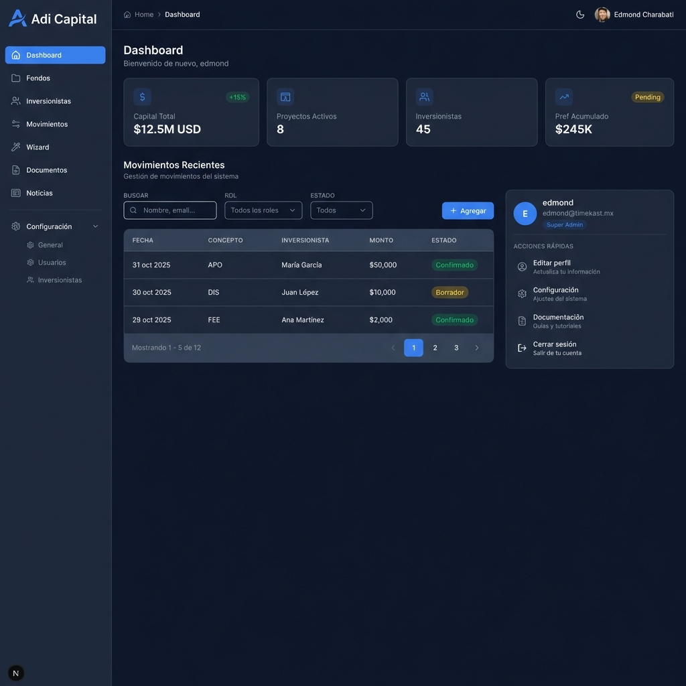
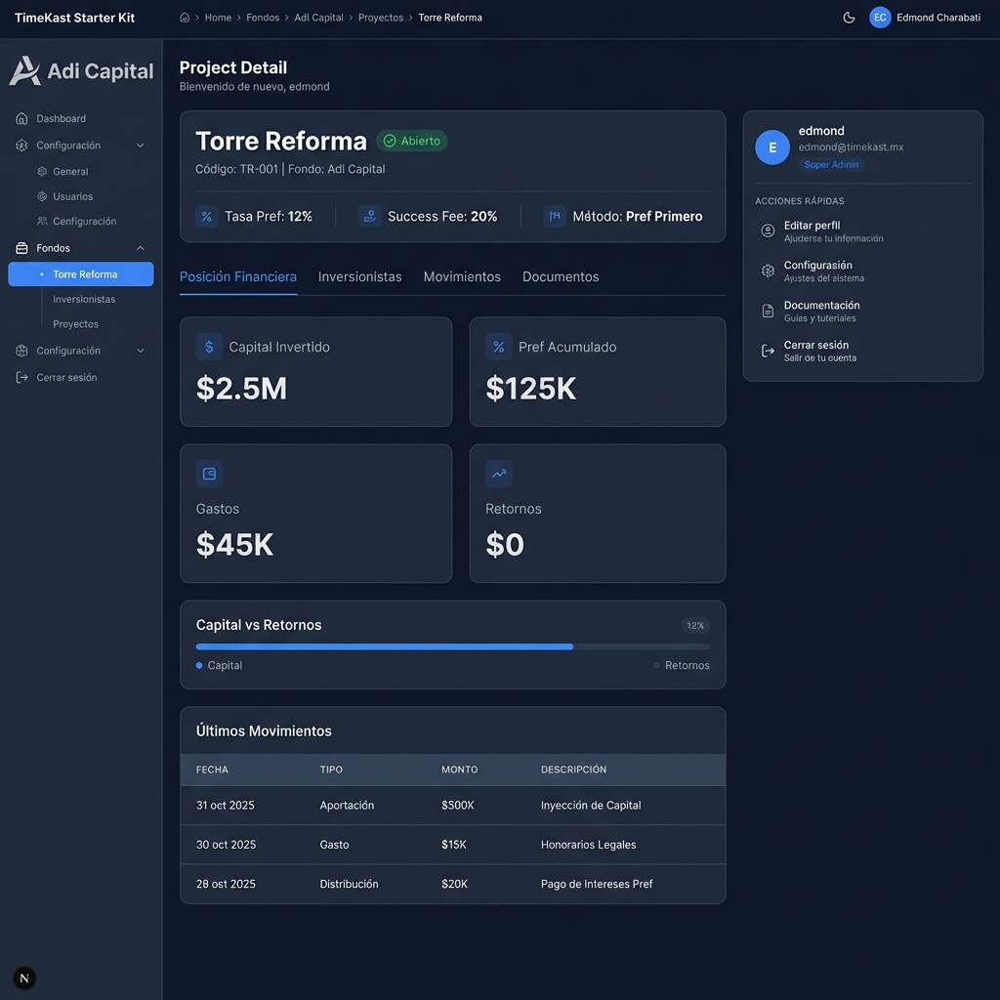
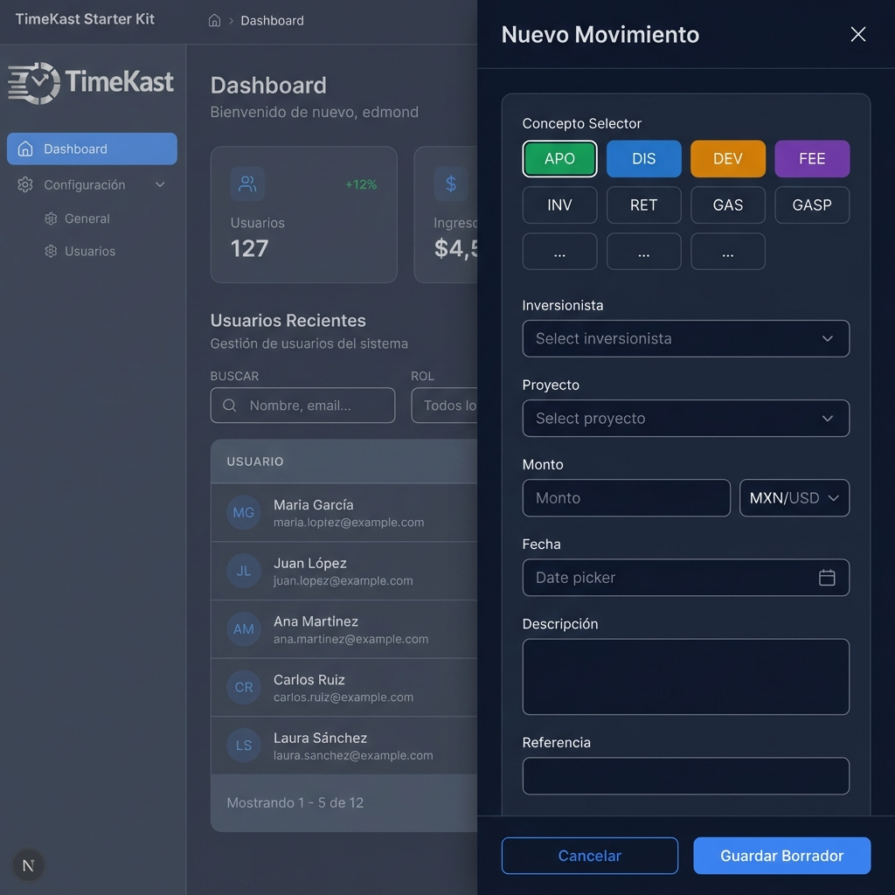
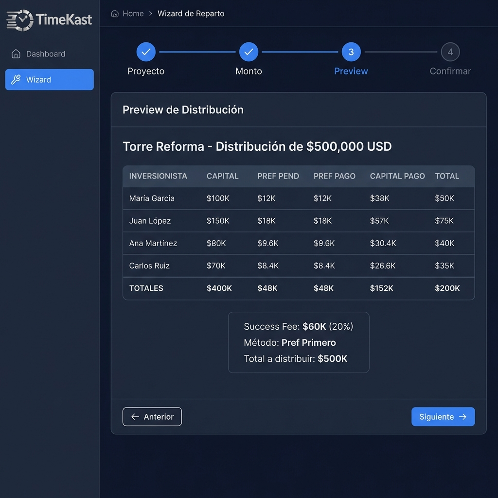
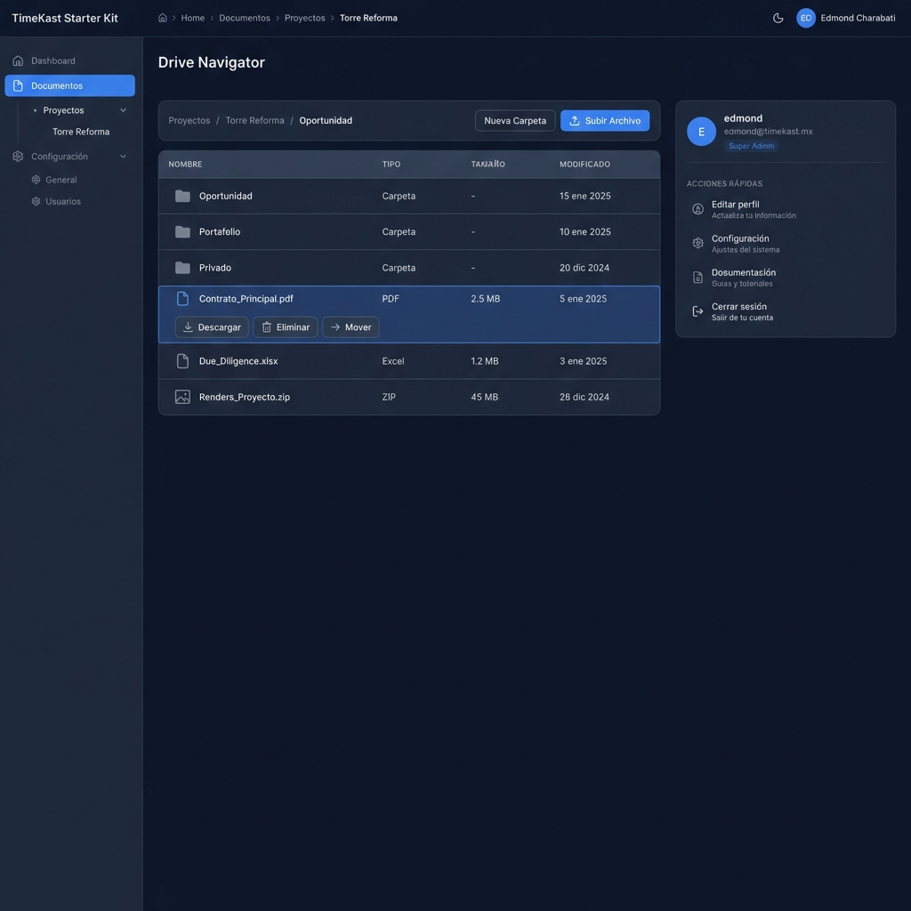

# 📐 Wireframes — Adi Capital Admin

> Generados desde Design Specification por `/design`
> **Base visual:** TimeKast Starter Kit (Midnight theme)
> **Fecha:** 2026-02-03

---

## Índice de Wireframes

| ID | Pantalla | Wireframe | Stories |
|----|----------|-----------|---------|
| SCR-001 | Dashboard |  | US-100-102 |
| SCR-021 | Proyecto Detalle |  | US-006-008 |
| SCR-051 | Form Movimiento |  | US-030-032 |
| SCR-060 | Wizard de Reparto |  | US-063-067 |
| SCR-070 | Drive Navigator |  | US-080-085 |

---

## Patrones Visuales

### Del Starter Kit (Reutilizar)
- **Sidebar**: 240px width, colapsable, nav groups
- **Header**: Breadcrumbs + avatar dropdown
- **Stats Cards**: Icon + label + value + % change
- **DataTable**: Filters above + pagination below
- **Right Panel**: Context info + quick actions

### Nuevos Patrones
- **Concepto Selector** (SCR-051): Grid de badges seleccionables
- **Wizard Stepper** (SCR-060): 4 steps con progress line
- **Drive Navigator** (SCR-070): File list con actions on select
- **Tabs** (SCR-021): Horizontal tabs para secciones

---

## Uso en Issues

Para referenciar un wireframe en un issue del backlog:

```markdown
## 📚 Referencias

**Wireframe:** [SCR-001_dashboard.png](../../wireframes/SCR-001_dashboard.png)
```

---

## Notas de Diseño

1. **Theme**: Midnight es el default, pero debe funcionar en Light y Dark
2. **Responsive**: Mobile-first, sidebar se convierte en drawer
3. **Touch targets**: Mínimo 44x44px para mobile
4. **Loading states**: Skeleton pattern consistente con SK

---

*Generado por TimeKast Factory — /design*
